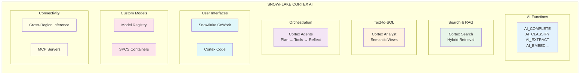

# 1.1 Snowflake Cortex AI Overview

> **Exam Domain:** 1.0 — Snowflake for Gen AI Overview (18%)  
> **Exam Objective:** Understand the architecture, capabilities, and components of Snowflake Cortex AI

---

## What is Snowflake Cortex AI?

Snowflake Cortex AI is a **fully managed, serverless AI service** built into the Snowflake Data Cloud. It provides instant access to large language models (LLMs), embedding models, and task-specific AI functions — all accessible through SQL, Python, or REST APIs without managing infrastructure.

> 📘 **Key Terms**
>
> | Term | Definition |
> |------|-----------|
> | **LLM** | Large Language Model — neural network for text generation |
> | **Serverless** | Snowflake manages all compute; no user-managed infrastructure |
> | **Token** | Smallest unit of text (~4 characters) |
> | **Embedding** | Dense vector representation of text for similarity search |
>
> *See full [Glossary](../GLOSSARY.md)*

### Key Characteristics (Exam-Critical)

| Feature | Description |
|---------|-------------|
| **Serverless** | No compute pools, clusters, or GPUs to manage |
| **Per-token billing** | Pay only for tokens processed (input + output) |
| **Data stays in Snowflake** | For Snowflake-hosted models, no data leaves the platform |
| **SQL-native** | All functions callable from standard SQL queries |
| **No model deployment** | Models are pre-deployed and ready to use |
| **RBAC-controlled** | Access governed by Snowflake roles and privileges |

---

## Cortex AI Product Suite



---

## Available Models

### Snowflake-Hosted Models (Data Never Leaves Snowflake)

| Provider | Model | Use Case | Context Window |
|----------|-------|----------|----------------|
| **Meta** | llama3.3-70b | General purpose, high quality | 128K |
| **Meta** | llama3.2-3b | Lightweight, low latency | 128K |
| **Meta** | llama3.2-1b | Ultra-lightweight | 128K |
| **Meta** | llama3.1-405b | Highest quality open-source | 128K |
| **Meta** | llama3.1-70b | Balanced quality/speed | 128K |
| **Meta** | llama3.1-8b | Fast, cost-efficient | 128K |
| **Meta** | llama4-maverick | Multimodal (text + images) | 128K |
| **Meta** | llama-4-scout | Multimodal (text + images) | 128K |
| **Mistral** | mistral-large2 | Reasoning, multilingual | 128K |
| **Mistral** | mistral-7b | Fast, efficient | 32K |
| **Mistral** | mixtral-8x7b | MoE architecture | 32K |
| **Mistral** | pixtral-large | Multimodal (images) | 128K |
| **DeepSeek** | deepseek-r1 | Advanced reasoning | 64K |
| **Google** | gemma-7b | Lightweight, open | 8K |
| **Google** | gemini-3.1-pro | Multimodal (audio/video) | 1M |
| **Google** | gemini-3.5-flash | Fast multimodal | 1M |
| **Snowflake** | snowflake-arctic | Enterprise optimized | 4K |

### Cross-Region Models (Require CORTEX_ENABLED_CROSS_REGION)

| Provider | Model | Context Window | Notes |
|----------|-------|----------------|-------|
| **Anthropic** | claude-sonnet-4-6 | 1M | Vision capable |
| **Anthropic** | claude-4-opus | 200K | Highest quality |
| **Anthropic** | claude-4-sonnet | 200K | Vision capable |
| **OpenAI** | openai-gpt-4.1 | 1M | Vision capable |

### Embedding Models

| Model | Dimensions | Use Case |
|-------|-----------|----------|
| arctic-embed-m-v1.5 | 768 | General text embeddings |
| arctic-embed-l-v2.0 | 1024 | Higher quality embeddings |
| voyage-multimodal-3 | 1024 | Image + text embeddings |
| twelvelabs-marengo-embed-3-0 | 512 | Video embeddings |

---

## Function Namespaces

Both namespaces are valid and tested on the exam:

```sql
-- Full namespace (original)
SELECT SNOWFLAKE.CORTEX.COMPLETE('llama3.1-70b', 'Explain RAG');

-- Short namespace (AI_ prefix, preferred for new code)
SELECT AI_COMPLETE('llama3.1-70b', 'Explain RAG');
```

### Complete Function Catalog

| Category | Functions |
|----------|-----------|
| **General** | AI_COMPLETE, TRY_COMPLETE |
| **Classification** | AI_CLASSIFY |
| **Extraction** | AI_EXTRACT |
| **Sentiment** | AI_SENTIMENT |
| **Summarization** | SUMMARIZE, AI_SUMMARIZE_AGG |
| **Translation** | AI_TRANSLATE |
| **Embeddings** | AI_EMBED, AI_MULTI_EMBED |
| **Filtering** | AI_FILTER |
| **Aggregation** | AI_AGG |
| **Similarity** | AI_SIMILARITY |
| **Transcription** | AI_TRANSCRIBE |
| **Redaction** | AI_REDACT |
| **Document Parsing** | AI_PARSE_DOCUMENT |
| **Token Counting** | AI_COUNT_TOKENS |
| **Text Splitting** | SPLIT_TEXT_RECURSIVE_CHARACTER, SPLIT_TEXT_MARKDOWN_HEADER |
| **File Reference** | TO_FILE |
| **Prompt Building** | PROMPT |

---

## Cortex AI Products Overview

### 1. Cortex Search (RAG)
- Hybrid search combining **semantic**, **keyword (BM25)**, and **attribute filtering**
- Managed vector embeddings + index
- Used for retrieval-augmented generation (RAG) applications
- Created with `CREATE CORTEX SEARCH SERVICE`

### 2. Cortex Analyst (Text-to-SQL)
- Natural language → SQL generation
- Powered by **Semantic Views** (structured metadata definitions)
- Supports **Verified Query Representations (VQR)** for accuracy
- Called via `SNOWFLAKE.CORTEX.ANALYST()` or through Cortex Agents

### 3. Cortex Agents (Orchestration)
- Agentic AI that combines multiple tools: Search + Analyst + SQL + Python
- Created with `CREATE CORTEX AGENT`
- Called via `SNOWFLAKE.CORTEX.AGENT()`
- Powers **CoWork** (the built-in Snowsight AI experience, formerly Snowflake Intelligence)

### 4. CoWork (formerly Snowflake Intelligence)
- Pre-built agent experience in Snowsight UI
- Uses configured Cortex Agents for natural language data exploration
- No code required for end users

### 5. Cortex Code
- AI-powered development assistant
- Available in: Snowsight (Copilot), Desktop IDE, CLI
- Helps write SQL, Python, and Snowflake configurations

### 6. Model Registry
- Register, version, and deploy custom ML models
- Supports: scikit-learn, PyTorch, XGBoost, Hugging Face, custom containers
- Provides model lineage and governance

---

## Security Model

### Data Protection Guarantees

| Model Type | Data Handling |
|------------|--------------|
| Snowflake-hosted (Meta, Mistral, DeepSeek, Google open, Snowflake) | Data NEVER leaves Snowflake infrastructure |
| Cross-region (Anthropic, OpenAI) | Data transits encrypted (mTLS), NOT stored at processing region |

### Key Security Features
- **Encryption in transit**: Always TLS/mTLS
- **No data persistence**: Processing regions do not store customer data
- **Same-cloud routing**: When possible, stays within cloud provider backbone
- **RBAC**: All access controlled by Snowflake roles
- **Audit logging**: All AI function calls logged in ACCOUNT_USAGE views

---

## Billing Model

### Token-Based Functions

| Component | Billing Method | What's Counted |
|-----------|---------------|----------------|
| **AI_COMPLETE** | Per token (input + output) | Prompt tokens + generated tokens |
| **AI_CLASSIFY** | Per token (input + output) | Labels, descriptions & examples counted as input **per row** (not once per call) |
| **AI_FILTER** | Per token (input + output) | Condition + input text |
| **AI_AGG** | Per token (input + output) | Processes in batches — no context window limit |
| **AI_EXTRACT** | Per token (input + output) | `responseFormat` argument counted as input tokens; 970 tokens/page for document files |
| **AI_TRANSLATE** | Per token (input + output) | Adds system prompt — billed tokens > your text tokens |
| **AI_REDACT** | Per token (input + output) | Input text + redacted output |
| **AI_SENTIMENT** | Per token (input + output) | Adds system prompt — billed tokens > your text tokens |
| **AI_SUMMARIZE_AGG** | Per token (input + output) | Adds system prompt — billed tokens > your text tokens |
| **SUMMARIZE** | Per token (input + output) | Same as AI_SUMMARIZE_AGG |
| **AI_EMBED / AI_SIMILARITY** | Per token (**input only**) | Only input tokens counted |
| **Cortex Guard** | Per token (**input only**) | # of input tokens = # of tokens output from AI_COMPLETE (billed additionally) |

### Page/Duration-Based Functions

| Component | Billing Method | What's Counted |
|-----------|---------------|----------------|
| **AI_PARSE_DOCUMENT** | Per page (970 tokens/page) | Each page in PDF/DOCX counted; each image file = 1 page; HTML/TXT = 3,000 chars per page |
| **AI_EXTRACT (on files)** | Per page (970 tokens/page) + output tokens | Pages as input tokens + extraction output tokens |
| **AI_TRANSCRIBE** | 50 tokens/second of audio | Audio duration-based |

### No Token Charges

| Component | Billing Method | Notes |
|-----------|---------------|-------|
| **AI_COUNT_TOKENS** | Compute only (warehouse) | Zero token charges |
| **SPLIT_TEXT_*** | Compute only (warehouse) | Zero token charges |
| **TO_FILE / PROMPT** | Free | No cost at all |

### Services & Products

| Component | Billing Method | Details |
|-----------|---------------|---------|
| **Cortex Search** | Serving (GB/month) + Embedding tokens + Warehouse compute | Serving cost: per GB/month of indexed data. Embedding: per token at indexing. Warehouse: for refresh queries. Storage: flat rate per TB |
| **Cortex Analyst (direct API)** | Per message (credits) | Billed per successful response. See `CORTEX_ANALYST_USAGE_HISTORY` |
| **Cortex Analyst (via Agents)** | Per token | Shows as `cortex_analyst` service_type in agent usage with input/output breakdown |
| **Cortex Agents** | Per request (token credits) | Aggregated across all tool calls in one request. See `CORTEX_AGENT_USAGE_HISTORY` |
| **CoWork** | Per request (token credits) | Tracked separately in `SNOWFLAKE_INTELLIGENCE_USAGE_HISTORY` |
| **SPCS (custom models)** | Per compute-hour (GPU instances) | Time-based billing for compute pools — not token-based |
| **Cortex REST API** | Per token (credits) | Same credit system as SQL functions — uses Snowflake Service Consumption Table rates |
| **Cross-region inference** | Same credit rate as local | Credits consumed in **requesting region**. No additional egress charges confirmed in current docs |
| **Fine-tuning (FINETUNE)** | Per token processed during training | Training tokens × model-specific rate. See `CORTEX_FINE_TUNING_USAGE_HISTORY` |

### Key Billing Facts for Exam

> ⚠️ **AI_CLASSIFY trap:** Labels, descriptions, and examples are counted as input tokens **for EACH row processed** — not just once per call. This means cost scales with both the number of categories AND the number of rows.

> ⚠️ **Cortex Guard trap:** It's billed **in addition** to AI_COMPLETE. The Guard's input tokens = the output tokens from AI_COMPLETE.

> ⚠️ **Warehouse sizing:** Snowflake recommends **no larger than MEDIUM** for AI functions. Larger warehouses do NOT increase performance.

> **Exam Tip:** Credits are consumed in the **requesting region**, regardless of where cross-region inference processes the request.

---

## Regional Availability

- Not all models are available in all regions
- Cross-region inference enables access to models not in your home region
- Set at account level: `ALTER ACCOUNT SET CORTEX_ENABLED_CROSS_REGION = 'ANY_REGION'`
- Only **ACCOUNTADMIN** can modify this parameter

---

## Exam Tips

1. **Know both namespaces**: `SNOWFLAKE.CORTEX.COMPLETE()` and `AI_COMPLETE()` are equivalent
2. **Serverless = no warehouse needed** for AI functions (they use serverless compute)
3. **Cross-region ≠ data at rest elsewhere** — only transient processing
4. **Snowflake-hosted models** = zero data leaves the platform
5. **CORTEX_ENABLED_CROSS_REGION** can only be set by ACCOUNTADMIN at account level
6. **Per-token billing** — larger prompts = more credits
7. **AI functions work on stages** — files must be on internal/external stages with SSE encryption
8. **Multimodal** — AI_COMPLETE, AI_TRANSCRIBE, AI_CLASSIFY, AI_EMBED support images/audio/video

---

## Quick Reference SQL

```sql
-- Check available models
SELECT * FROM INFORMATION_SCHEMA.AI_MODELS;

-- Basic completion
SELECT AI_COMPLETE('llama3.1-70b', 'What is Snowflake Cortex?');

-- With structured output (JSON mode)
SELECT AI_COMPLETE('llama3.1-70b', 'List 3 benefits of RAG',
  {}, {'type': 'json'});

-- Check cross-region setting
SHOW PARAMETERS LIKE 'CORTEX_ENABLED_CROSS_REGION' IN ACCOUNT;

-- Enable cross-region
ALTER ACCOUNT SET CORTEX_ENABLED_CROSS_REGION = 'ANY_REGION';
```

---

## References

- [Snowflake Cortex AI Overview](https://docs.snowflake.com/en/user-guide/snowflake-cortex/overview)
- [Available Models and Regions](https://docs.snowflake.com/en/user-guide/snowflake-cortex/llm-functions#available-models)
- [Cross-Region Inference](https://docs.snowflake.com/en/user-guide/snowflake-cortex/cross-region-inference)
- [Cortex AI Functions](https://docs.snowflake.com/en/user-guide/snowflake-cortex/aisql)
- [Cortex AI Multimodal](https://docs.snowflake.com/en/user-guide/snowflake-cortex/ai-multimodal)

---

<p align="center">
  <a href="./README.md">&#127968; Domain Home</a> &nbsp;&nbsp;|&nbsp;&nbsp;
  <a href="../README.md">&#128218; Main Home</a> &nbsp;&nbsp;|&nbsp;&nbsp;
  <a href="./1.2_Cortex_Search.md">Next: 1.2 Cortex Search &#8594;</a>
</p>
