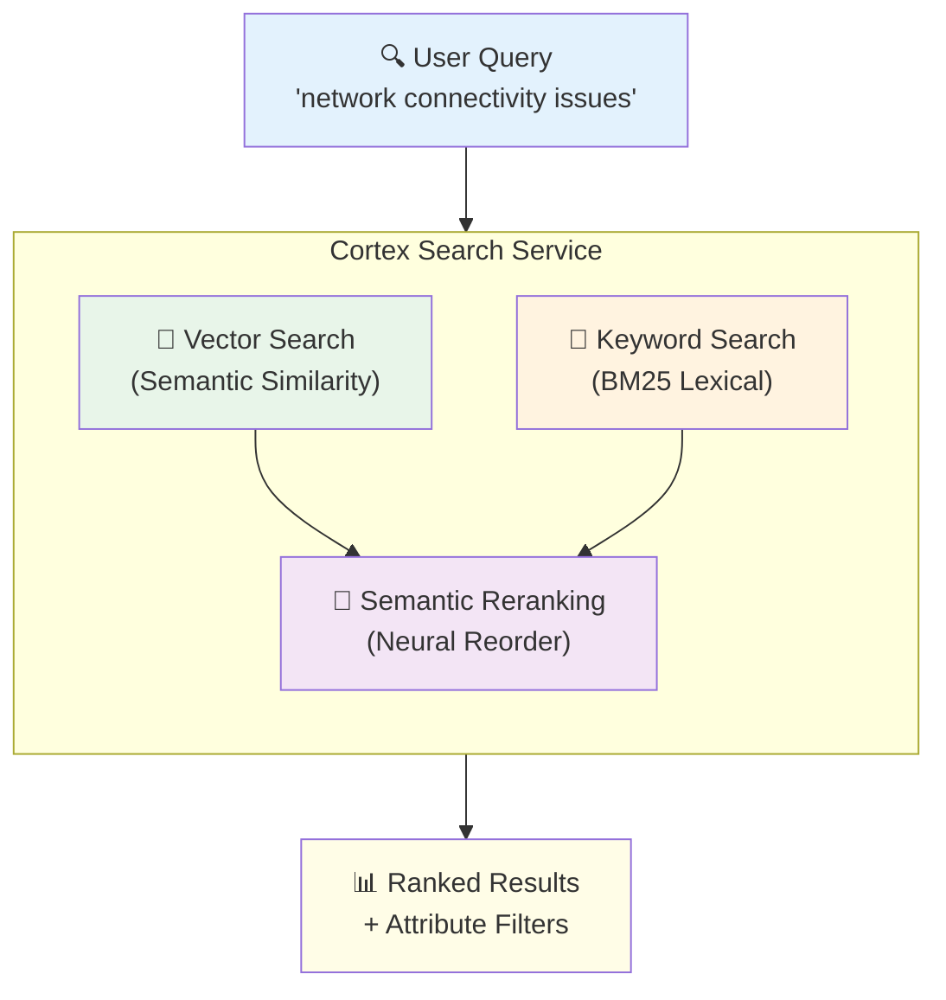

# 1.2 Cortex Search — Complete Reference

> **Exam Domain:** 1.0 — Snowflake for Gen AI Overview (18%)  
> **Exam Objective:** Understand Cortex Search capabilities, configuration parameters, limits, and RAG patterns

---

## What is Cortex Search?

Cortex Search is a **fully managed hybrid search engine** for low-latency, high-quality retrieval over Snowflake data. It powers **Retrieval-Augmented Generation (RAG)** by combining:

1. **Vector search** (semantic) — finds semantically similar content via embeddings
2. **Keyword search** (BM25/lexical) — finds lexically matching content
3. **Semantic reranking** — neural model reorders top results for maximum relevance

**GA Date:** October 4, 2024

---

## Architecture



---

## CREATE CORTEX SEARCH SERVICE — Complete Syntax

### Single-Index (Most Common)

```sql
CREATE [ OR REPLACE ] CORTEX SEARCH SERVICE [ IF NOT EXISTS ] <name>
  ON <search_column>
  [ PRIMARY KEY ( <col_name> [, ... ] ) ]
  ATTRIBUTES <col_name> [ , ... ]
  WAREHOUSE = <warehouse_name>
  TARGET_LAG = '<num> { seconds | minutes | hours | days }'
  [ EMBEDDING_MODEL = <embedding_model_name> ]
  [ REFRESH_MODE = { FULL | INCREMENTAL } ]
  [ INITIALIZE = { ON_CREATE | ON_SCHEDULE } ]
  [ FULL_INDEX_BUILD_INTERVAL_DAYS = <num> ]
  [ REQUEST_LOGGING = { TRUE | FALSE } ]
  [ AUTO_SUSPEND = <num_seconds> ]
  [ COMMENT = '<comment>' ]
AS <query>;
```

### Multi-Index

```sql
CREATE [ OR REPLACE ] CORTEX SEARCH SERVICE <name>
  TEXT INDEXES <text_column_name> [ , ... ]
  VECTOR INDEXES <column_specification> [ , ... ]
  [ PRIMARY KEY ( <col_name> [, ... ] ) ]
  ATTRIBUTES <col_name> [ , ... ]
  WAREHOUSE = <warehouse_name>
  TARGET_LAG = '<num> { seconds | minutes | hours | days }'
  [ REFRESH_MODE = { FULL | INCREMENTAL } ]
  [ ... other optional params ... ]
AS <query>;
```

---

## ALL Parameters — Detailed Reference

### Required Parameters

| Parameter | Description | Notes |
|-----------|-------------|-------|
| `ON <search_column>` | Primary text column to search (single-index) | Must be TEXT type |
| `TEXT INDEXES` | Text columns for keyword search (multi-index) | Must be TEXT type |
| `VECTOR INDEXES` | Columns for vector search (multi-index) | At least one required for multi-index |
| `ATTRIBUTES` | Columns available for query-time filtering | Must be in source query |
| `WAREHOUSE` | Warehouse for source query + refresh | **Recommend MEDIUM or smaller** |
| `TARGET_LAG` | Max allowed staleness | Format: '1 hour', '30 minutes', '1 day' |

### Optional Parameters

| Parameter | Default | Description | **Exam-Critical Details** |
|-----------|---------|-------------|---------------------------|
| `PRIMARY KEY` | None | Columns uniquely identifying rows | TEXT type only. Enables optimized incremental refresh |
| `EMBEDDING_MODEL` | `snowflake-arctic-embed-m-v1.5` | Model for generating embeddings | **Cannot be changed after creation** (must recreate service) |
| `REFRESH_MODE` | `INCREMENTAL` | How data updates are applied | **Cannot be changed after creation**. FULL recomputes all embeddings every refresh |
| `INITIALIZE` | `ON_CREATE` | When first refresh happens | ON_SCHEDULE delays first population to next TARGET_LAG cycle |
| `FULL_INDEX_BUILD_INTERVAL_DAYS` | 1 | Days between full index compactions | Only for services WITH primary keys |
| `REQUEST_LOGGING` | FALSE | Log search requests for monitoring | Queryable for analysis |
| `AUTO_SUSPEND` | NULL (disabled) | Seconds before auto-suspend | **Minimum: 1800 seconds (30 minutes)**. Service resumes on next query (takes a few minutes) |
| `COMMENT` | None | Description text | Standard Snowflake comment |

---

## AUTO_SUSPEND Deep Dive (Exam Question Topic)

```sql
-- Enable auto-suspend (minimum 1800 = 30 minutes)
CREATE CORTEX SEARCH SERVICE my_service
  ON text_column
  WAREHOUSE = wh
  TARGET_LAG = '1 hour'
  AUTO_SUSPEND = 1800        -- ← MINIMUM VALUE
AS SELECT * FROM my_table;

-- Alter existing service
ALTER CORTEX SEARCH SERVICE my_service SET AUTO_SUSPEND = 3600;

-- Disable auto-suspend
ALTER CORTEX SEARCH SERVICE my_service SET AUTO_SUSPEND = NULL;
```

**Key facts:**
- **Minimum value: 1800 seconds (30 minutes)** — cannot set lower
- **Default: NULL** (auto-suspend disabled — runs continuously)
- **Resume behavior:** First query after suspension pauses until service resumes (typically a few minutes)
- **Use case:** Cost savings on idle services
- **GA: May 11, 2026** (Public Preview)

---

## EMBEDDING_MODEL Options

| Model | Dimensions | Context Window | Language | Notes |
|-------|-----------|---------------|----------|-------|
| `snowflake-arctic-embed-m-v1.5` | 768 | 512 tokens | English | **Default** |
| `snowflake-arctic-embed-l-v2.0` | 1024 | 512 tokens | Multilingual | Higher quality |
| `snowflake-arctic-embed-l-v2.0-8k` | 1024 | 8192 tokens | Multilingual | Long documents |
| `voyage-multilingual-2` | 1024 | 32,000 tokens | Multilingual | Largest context |

> **Exam Trap:** EMBEDDING_MODEL **cannot be altered** after creation. Must `CREATE OR REPLACE` to change it.

> **Best Practice:** Split text into chunks ≤512 tokens (~385 English words) for optimal results with default model.

---

## REFRESH_MODE Details

| Mode | Behavior | When to Use |
|------|----------|-------------|
| `INCREMENTAL` (default) | Only processes changed rows since last refresh | Most workloads (efficient for large datasets with small updates) |
| `FULL` | Recomputes ALL embeddings + rebuilds index every refresh | Only when incremental isn't supported for your workload |

**Cannot be changed after creation** — must recreate the service.

**Incremental requirements:**
- Change tracking must be enabled on all base tables
- Non-zero time travel retention on underlying objects
- If service can't do incremental, creation FAILS with error

**Auto-suspend of indexing:** After **5 consecutive refresh failures**, indexing auto-suspends. Existing index remains queryable but won't update.

---

## PRIMARY KEY Benefits

```sql
CREATE CORTEX SEARCH SERVICE my_service
  ON content
  PRIMARY KEY (doc_id)       -- ← Enables optimized refresh
  ATTRIBUTES category
  WAREHOUSE = wh
  TARGET_LAG = '1 hour'
AS SELECT doc_id, content, category FROM documents;
```

- **Must be TEXT type columns**
- Enables **optimized incremental refresh** — only changed rows re-embedded
- Significantly reduces refresh cost and latency
- `FULL_INDEX_BUILD_INTERVAL_DAYS` only applies to services WITH primary keys
- Duplicate primary key values → those rows are **ignored** in the index

---

## Three Query APIs

### 1. Python SDK (Production — Recommended)

```python
from snowflake.core import Root
from snowflake.snowpark import Session

root = Root(session)
service = (root
    .databases["MY_DB"].schemas["MY_SCHEMA"]
    .cortex_search_services["my_service"]
)

response = service.search(
    query="network connectivity problems",
    columns=["content", "source", "date"],
    filter={"@eq": {"region": "US"}},
    limit=5
)
```

**Requires:** `snowflake` package version ≥ 0.8.0  
**Response limit:** 10 MB  
**Result limit:** Up to 1000 per query (default: 10)

### 2. REST API (Production)

```
POST /api/v2/databases/<db>/schemas/<schema>/cortex-search-services/<service>:query
Authorization: Bearer <PAT>
Content-Type: application/json

{
  "query": "network issues",
  "columns": ["content", "source"],
  "filter": {"@eq": {"region": "US"}},
  "limit": 5
}
```

**Auth:** PAT, JWT, or OAuth  
**Response limit:** 10 MB

### 3. SQL SEARCH_PREVIEW (Testing ONLY)

```sql
SELECT PARSE_JSON(
  SNOWFLAKE.CORTEX.SEARCH_PREVIEW(
    'my_db.my_schema.my_service',
    '{"query": "network issues", "columns": ["content"], "limit": 5}'
  )
)['results'] AS results;
```

**⚠️ NOT for production:**
- Higher latency than Python/REST
- **300 KB response limit** (vs 10 MB for other APIs)
- Only accepts string literals (not table columns)
- Cannot process batch data

---

## Filter Operators (Complete Reference)

### Matching Operators

| Operator | Type | Example |
|----------|------|---------|
| `@eq` | TEXT or NUMERIC equality | `{"@eq": {"region": "US"}}` |
| `@contains` | ARRAY contains value | `{"@contains": {"tags": "urgent"}}` |
| `@gte` | NUMERIC/DATE ≥ | `{"@gte": {"score": 0.8}}` |
| `@lte` | NUMERIC/DATE ≤ | `{"@lte": {"date": "2024-01-01"}}` |
| `@primarykey` | Primary key match | `{"@primarykey": {"id": "abc123"}}` |

### Logical Operators

| Operator | Example |
|----------|---------|
| `@and` | `{"@and": [{"@eq": {...}}, {"@gte": {...}}]}` |
| `@or` | `{"@or": [{"@eq": {...}}, {"@eq": {...}}]}` |
| `@not` | `{"@not": {"@eq": {"status": "deleted"}}}` |

### Supported Attribute Data Types

- TEXT (for @eq)
- NUMERIC (for @eq, @gte, @lte)
- ARRAY (for @contains)
- DATE (for @gte, @lte) — format: `YYYY-MM-DD`
- TIMESTAMP (for @gte, @lte) — format: `YYYY-MM-DDTHH:MM:SS.sss+HH:MM` (UTC if no timezone)

---

## Scoring Configuration (Advanced)

### Scoring Weights

```python
response = service.search(
    query="technology",
    columns=["content"],
    scoring_config={
        "weights": {
            "texts": 1,      # BM25 keyword weight
            "vectors": 4,    # Semantic vector weight  
            "reranker": 1    # Neural reranker weight
        }
    }
)
```

**Key:** Weights are **relative** — {1,4,1} = {10,40,10} = {100,400,100}

### Numeric Boosts

Boost results by column values (e.g., popularity):

```python
scoring_config={
    "functions": {
        "numeric_boosts": [
            {"column": "likes", "weight": 1},
            {"column": "comments", "weight": 2}
        ]
    }
}
```

### Time Decays

Prefer recent documents:

```python
scoring_config={
    "functions": {
        "time_decays": [
            {"column": "last_modified", "weight": 1, "limit_hours": 240,
             "now": "2024-04-23T00:00:00.000-08:00"}
        ]
    }
}
```

### Disable Reranking (Faster, Less Accurate)

```python
scoring_config={"reranker": "none"}
```

### Text/Vector Boosts (Multi-Index)

```python
scoring_config={
    "functions": {
        "text_boosts": [{"column": "name", "weight": 2}],
        "vector_boosts": [{"column": "description", "weight": 3}]
    }
}
```

---

## Multi-Index Queries

### Rules
- **At least one vector index** must be queried (text-only = error)
- **AND across fields** — all queried fields must match
- **OR within a text field** — any query term in that field matches
- Text queries use stemming/lemmatization (e.g., "washing" matches "wash")

### Vector Index Types

| Type | Syntax | Who Manages Embeddings |
|------|--------|----------------------|
| Managed | `description (model='snowflake-arctic-embed-m-v1.5')` | Snowflake auto-generates |
| User-provided | `embedding_column` | You compute and load vectors |
| User-provided + managed query | `embedding_column(query_model='...')` | You provide doc embeddings; Snowflake embeds queries |

---

## Limits (Exam-Critical)

| Limit | Value |
|-------|-------|
| **Max rows** | 400 million |
| **Max QPS per service** | 20 |
| **Max QPS per account** | 140 |
| **Response size (REST/Python)** | 10 MB |
| **Response size (SEARCH_PREVIEW)** | 300 KB |
| **Results per query** | Up to 1000 (default: 10) |
| **AUTO_SUSPEND minimum** | 1800 seconds (30 minutes) |
| **Cloning** | NOT supported |
| **Custom network policies** | NOT supported (incompatible) |
| **Change tracking** | Must be enabled on base tables |
| **Refresh failure threshold** | 5 consecutive → auto-suspend indexing |

---

## Access Control

| Action | Required Privilege |
|--------|-------------------|
| **Create** service | `CREATE CORTEX SEARCH SERVICE` on schema + (`SNOWFLAKE.CORTEX_USER` OR `SNOWFLAKE.CORTEX_EMBED_USER`) |
| **Query** service | `USAGE` on service + `USAGE` on database + `USAGE` on schema |
| **Suspend/Resume** | `OPERATE` privilege on service |
| **Alter** | `MODIFY` or `OWNERSHIP` |

### Security Model: Owner's Rights

**Critical concept:** Queries execute with the **service owner's** privileges, NOT the querying user's.

**Implication:** A user with USAGE on the service can see ANY data the owner can read from the underlying tables — even if the user doesn't have SELECT on those tables directly.

**Row-level security:** If the owner's role can read rows that the querying user cannot, the querying user WILL see those rows via the search service.

**Best practice:** Be cautious when granting USAGE on services that reference sensitive data.

---

## Cortex Search as Agent Tool

```yaml
tools:
  - tool_spec:
      type: "cortex_search"
      name: "PolicySearch"
      description: "Search company policies and procedures"

tool_resources:
  PolicySearch:
    name: "my_db.my_schema.policy_search_service"
    max_results: "5"
```

---

## Batch Search (CORTEX_SEARCH_BATCH)

For high-throughput offline workloads (entity resolution, deduplication):

```sql
SELECT * FROM TABLE(
    CORTEX_SEARCH_BATCH(
        service_name => 'my_service',
        input_table => 'query_table',
        query_column => 'search_text',
        response_column => 'results',
        top_k => 10
    )
);
```

**Use when:** 2,000+ queries. Higher throughput than interactive APIs. Has startup latency — not for real-time.

---

## RAG Pattern: Search + AI_COMPLETE

```python
def answer_question(question):
    # 1. Retrieve context
    results = search_service.search(
        query=question, columns=["content", "source"], limit=5
    )
    context = "\n".join([r["content"] for r in results.results])
    
    # 2. Generate answer grounded in context
    prompt = f"""Answer ONLY from the context below.
    
    <context>{context}</context>
    
    Question: {question}"""
    
    response = session.sql(
        "SELECT AI_COMPLETE('llama3.1-70b', ?)", [prompt]
    ).collect()[0][0]
    return response
```

---

## ALTER CORTEX SEARCH SERVICE

```sql
-- Change target lag
ALTER CORTEX SEARCH SERVICE my_service SET TARGET_LAG = '30 minutes';

-- Enable auto-suspend
ALTER CORTEX SEARCH SERVICE my_service SET AUTO_SUSPEND = 1800;

-- Disable auto-suspend
ALTER CORTEX SEARCH SERVICE my_service SET AUTO_SUSPEND = NULL;

-- Suspend manually
ALTER CORTEX SEARCH SERVICE my_service SUSPEND;

-- Resume manually
ALTER CORTEX SEARCH SERVICE my_service RESUME;

-- Enable request logging
ALTER CORTEX SEARCH SERVICE my_service SET REQUEST_LOGGING = TRUE;
```

**Cannot be altered (must recreate):** EMBEDDING_MODEL, REFRESH_MODE, INITIALIZE

---

## Warehouse Recommendations

- Use **MEDIUM or smaller** (larger doesn't improve refresh speed meaningfully during preview)
- Use a **dedicated warehouse** per service (don't share with other workloads)
- Warehouse affects refresh speed/cost, NOT query latency

---

## Exam Tips Summary

1. **AUTO_SUSPEND minimum = 1800 seconds (30 minutes)** — cannot go lower
2. **EMBEDDING_MODEL cannot be changed after creation** — must recreate
3. **REFRESH_MODE cannot be changed after creation** — must recreate
4. **Owner's rights** — users can see data they don't have SELECT on
5. **SEARCH_PREVIEW = testing only** (300KB limit, higher latency, no batch)
6. **Primary keys must be TEXT** — enable optimized incremental refresh
7. **5 consecutive failures** → auto-suspend indexing
8. **Max 400M rows**, 20 QPS/service, 140 QPS/account
9. **At least one vector index required** for multi-index services
10. **Scoring weights are relative** — {1,4,1} same as {10,40,10}
11. **Default embedding model:** snowflake-arctic-embed-m-v1.5 (768d, 512 tokens)
12. **Warehouse MEDIUM or smaller** — recommended, dedicated per service
13. **Change tracking required** on base tables for incremental refresh
14. **TARGET_LAG must be shorter** than DATA_RETENTION_TIME_IN_DAYS
15. **No cloning** support for Cortex Search services
16. **Incompatible** with custom network policies

---

## References

- [Cortex Search Overview](https://docs.snowflake.com/en/user-guide/snowflake-cortex/cortex-search/cortex-search-overview)
- [CREATE CORTEX SEARCH SERVICE](https://docs.snowflake.com/en/sql-reference/sql/create-cortex-search)
- [ALTER CORTEX SEARCH SERVICE](https://docs.snowflake.com/en/sql-reference/sql/alter-cortex-search)
- [Query a Cortex Search Service](https://docs.snowflake.com/en/user-guide/snowflake-cortex/cortex-search/query-cortex-search-service)
- [Auto-Suspend (May 2026)](https://docs.snowflake.com/en/release-notes/2026/other/2026-05-11-cortex-search-auto-suspend-preview)
- [Batch Search](https://docs.snowflake.com/en/user-guide/snowflake-cortex/cortex-search/batch-cortex-search)

---

<p align="center">
  <a href="./1.1_Snowflake_Cortex_Overview.md">&#8592; Previous: 1.1 Cortex Overview</a> &nbsp;&nbsp;|&nbsp;&nbsp;
  <a href="./README.md">&#127968; Domain Home</a> &nbsp;&nbsp;|&nbsp;&nbsp;
  <a href="../README.md">&#128218; Main Home</a> &nbsp;&nbsp;|&nbsp;&nbsp;
  <a href="./1.2a_Cortex_Search_Advanced.md">Next: 1.2a Cortex Search Advanced &#8594;</a>
</p>
