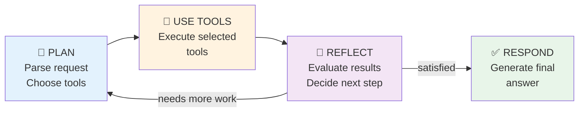

# 1.4 Cortex Agents

> **Exam Domain:** 1.0 — Snowflake for Gen AI Overview (18%)  
> **Exam Objective:** Understand Cortex Agents architecture, tool integration, and orchestration

---

## What Are Cortex Agents?

Cortex Agents is a **fully managed agentic AI platform** that reasons over requests, plans work, calls tools, executes code, and generates responses — all without requiring you to build orchestration loops.

### Core Reasoning Loop



1. **Plan** — Parse request, disambiguate, split into subtasks, choose tools
2. **Use Tools** — Call Cortex Analyst, Search, execute code, etc.
3. **Reflect** — Evaluate results, decide next action or generate final response

---

## CREATE AGENT

```sql
CREATE OR REPLACE AGENT my_analytics_agent
  COMMENT = 'Multi-tool analytics assistant'
FROM SPECIFICATION
$$
models:
  orchestration: auto

orchestration:
  budget:
    seconds: 30
    tokens: 16000

instructions:
  response: "Respond concisely with data-driven answers"
  orchestration: "Use RevenueAnalyst for sales/revenue questions.
                  Use PolicySearch for company policy questions.
                  Use code execution for calculations."
  sample_questions:
    - question: "What was Q4 revenue by region?"
    - question: "What is our refund policy?"

tools:
  - tool_spec:
      type: "cortex_analyst_text_to_sql"
      name: "RevenueAnalyst"
      description: "Answers revenue, sales, and order questions"
  - tool_spec:
      type: "cortex_search"
      name: "PolicySearch"
      description: "Searches company policies and documentation"
  - tool_spec:
      type: "data_to_chart"
      name: "data_to_chart"
      description: "Creates visualizations from data"

tool_resources:
  RevenueAnalyst:
    semantic_view: "analytics.public.revenue_sv"
  PolicySearch:
    name: "docs.public.policy_search_service"
    max_results: "5"
$$;
```

---

## Available Tools

| Tool Type | Spec String | Purpose |
|-----------|-------------|---------|
| **Cortex Analyst** | `cortex_analyst_text_to_sql` | Text-to-SQL over semantic views |
| **Cortex Search** | `cortex_search` | RAG retrieval from unstructured data |
| **Code Execution** | Built-in | Python in secure sandbox |
| **Data to Chart** | `data_to_chart` | Generate visualizations |
| **Custom Tools** | `generic` | UDFs and stored procedures |
| **MCP Connectors** | Via `mcp_servers` | External tools (Jira, Salesforce, etc.) |
| **Web Search** | `web_search` | Real-time internet search (Brave API) |
| **Agent Skills** | Via SKILL.md | Packaged reusable capabilities |
| **Agent Toolsets** | References to other agents | Composable agent architectures |

---

## Calling Agents

### SQL: DATA_AGENT_RUN (Named Agent)

```sql
SELECT TRY_PARSE_JSON(
  SNOWFLAKE.CORTEX.DATA_AGENT_RUN(
    'MY_DB.MY_SCHEMA.MY_AGENT',
    $${
      "messages": [
        {"role": "user", "content": [{"type": "text", "text": "What was Q4 revenue?"}]}
      ]
    }$$
  )
) AS response;
```

### SQL: AGENT_RUN (Without Agent Object)

```sql
SELECT TRY_PARSE_JSON(
  SNOWFLAKE.CORTEX.AGENT_RUN(
    $${
      "messages": [{"role": "user", "content": [{"type": "text", "text": "Hello"}]}],
      "models": {"orchestration": "claude-4-sonnet"},
      "tools": [
        {"tool_spec": {"type": "cortex_search", "name": "MySearch"}}
      ],
      "tool_resources": {
        "MySearch": {"name": "db.schema.service", "max_results": "3"}
      }
    }$$
  )
) AS response;
```

### REST API

```
POST /api/v2/databases/{db}/schemas/{schema}/agents/{name}:run

{
  "messages": [...],
  "thread_id": "abc-123",
  "parent_message_id": "msg-456"
}
```

### Version Suffixes

| Suffix | Meaning |
|--------|---------|
| `!LIVE` | Current live/default version |
| `!DEFAULT` | Same as LIVE |
| `!VERSION$N` | Specific version number |
| `!LAST` | Most recently committed version |
| `!FIRST` | First version |

---

## Agent Configuration

### Model Selection

```yaml
models:
  orchestration: auto   # Recommended: Snowflake picks best model
  # Or specify: claude-4-sonnet, openai-gpt-4.1, etc.
```

### Instructions

| Field | Purpose |
|-------|---------|
| `response` | Controls tone/format of answers |
| `orchestration` | Guides tool selection logic |
| `sample_questions` | Example prompts shown to users |

### Budget Controls

```yaml
orchestration:
  budget:
    seconds: 30     # Time limit for orchestration
    tokens: 16000   # Token limit (excludes tool tokens)
```

### Threads (Persistent Conversations)

- Enable multi-turn conversations with context persistence
- Create via REST API, reference by `thread_id` + `parent_message_id`
- Agent uses thread history for context in follow-up questions

---

## Snowflake CoWork (formerly Intelligence)

Snowflake CoWork is the **built-in agent experience in Snowsight** where end users interact with Cortex Agents through natural language chat.

- Accessed via Snowsight UI (AI & ML → Agents)
- Agents appear automatically once created and granted USAGE
- Supports MCP connectors in the sources panel
- Enables feedback collection (ratings + comments)
- Agent playground available for testing

---

## Access Control

### Required Roles

| Role | Access Level |
|------|-------------|
| `SNOWFLAKE.CORTEX_USER` | Full Cortex access (includes Agents) |
| `SNOWFLAKE.CORTEX_AGENT_USER` | **Agents-only** access (least privilege) |

### Privileges

| Privilege | Object | Purpose |
|-----------|--------|---------|
| `CREATE AGENT` | Schema | Create agent objects |
| `USAGE` | Agent | Run/invoke the agent |
| `OWNERSHIP` / `MODIFY` | Agent | Alter agent configuration |
| `USAGE` | Cortex Search Service | For search tools |
| `SELECT` | Semantic View | For Analyst tools |

### Example Setup

```sql
CREATE ROLE agent_user_role;
GRANT DATABASE ROLE SNOWFLAKE.CORTEX_AGENT_USER TO ROLE agent_user_role;
GRANT USAGE ON DATABASE my_db TO ROLE agent_user_role;
GRANT USAGE ON SCHEMA my_db.my_schema TO ROLE agent_user_role;
GRANT USAGE ON AGENT my_db.my_schema.my_agent TO ROLE agent_user_role;
```

---

## Agent Evaluations

Evaluate agent quality using the **GPA (Goal-Plan-Action)** framework:

| Metric | What It Measures |
|--------|-----------------|
| **Tool selection accuracy** | Did the agent invoke the right tools? |
| **Tool execution accuracy** | Did tools receive correct inputs? |
| **Answer correctness** | Does final response match ground truth? |
| **Logical consistency** | Is reasoning internally consistent? |

---

## Custom Tools (Generic)

Expose stored procedures or UDFs as agent tools:

```yaml
tools:
  - tool_spec:
      type: "generic"
      name: "get_customer_details"
      description: "Retrieves full customer profile by ID"
      parameters:
        - name: "customer_id"
          type: "string"
          description: "The customer identifier"
          required: true

tool_resources:
  get_customer_details:
    type: "function"
    function: "my_db.my_schema.get_customer_details"
```

---

## Exam Tips

1. **Agents orchestrate tools** — they don't replace Analyst or Search, they combine them
2. **`auto` model** is recommended for orchestration (Snowflake picks best)
3. **CORTEX_AGENT_USER** is least-privilege for agent-only access
4. **Threads** enable persistent multi-turn conversations
5. **Budget** limits orchestration time/tokens (not tool execution)
6. **Code execution** runs Python in a sandboxed environment
7. **DATA_AGENT_RUN** for named agents, **AGENT_RUN** for inline spec
8. **Agent evaluations** use GPA framework (Goal-Plan-Action)
9. **Agents determine permissions** from the querying user's default role
10. **Version suffixes** (!LIVE, !VERSION$N) control which version runs

---

## References

- [Cortex Agents Overview](https://docs.snowflake.com/en/user-guide/snowflake-cortex/cortex-agents)
- [Create & Manage Agents](https://docs.snowflake.com/en/user-guide/snowflake-cortex/cortex-agents-manage)
- [CREATE AGENT](https://docs.snowflake.com/en/sql-reference/sql/create-agent)
- [DATA_AGENT_RUN](https://docs.snowflake.com/en/sql-reference/functions/data_agent_run-snowflake-cortex)
- [Agent Evaluations](https://docs.snowflake.com/en/user-guide/snowflake-cortex/cortex-agents-evaluations)
- [Cortex Agents REST API](https://docs.snowflake.com/en/user-guide/snowflake-cortex/cortex-agents-rest-api)

---

<p align="center">
  <a href="./1.3_Cortex_Analyst.md">&#8592; Previous: 1.3 Cortex Analyst</a> &nbsp;&nbsp;|&nbsp;&nbsp;
  <a href="./README.md">&#127968; Domain Home</a> &nbsp;&nbsp;|&nbsp;&nbsp;
  <a href="../README.md">&#128218; Main Home</a> &nbsp;&nbsp;|&nbsp;&nbsp;
  <a href="./1.5_Snowflake_Intelligence.md">Next: 1.5 Snowflake Intelligence &#8594;</a>
</p>
