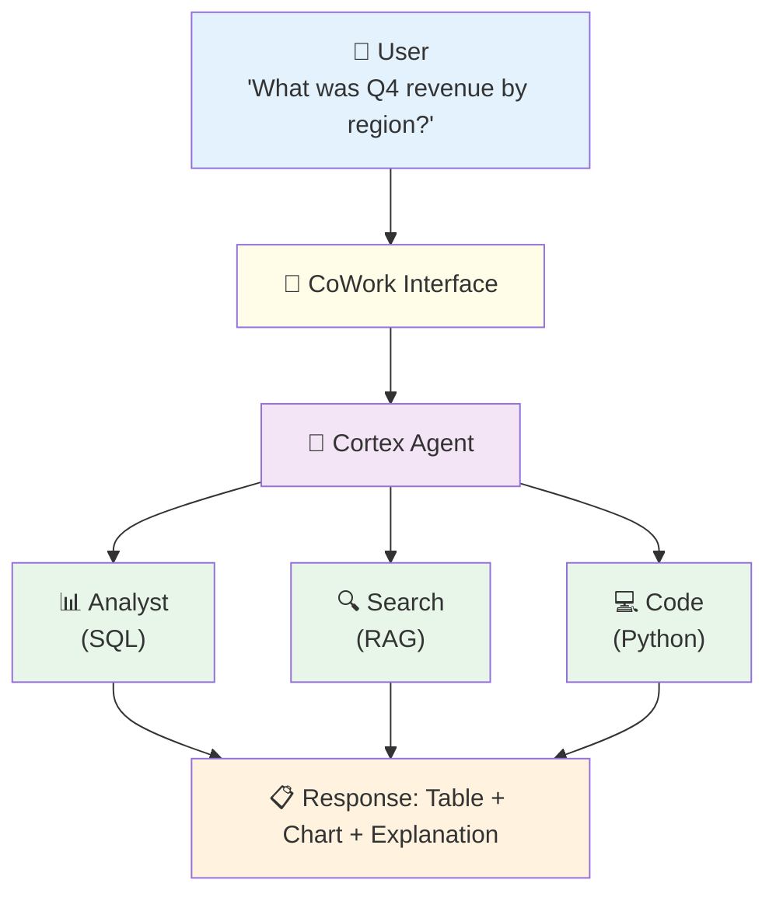

# 1.5 CoWork (formerly Snowflake Intelligence)

> **Exam Domain:** 1.0 — Snowflake for Gen AI Overview (18%)  
> **Exam Objective:** Understand the built-in agent experience in Snowsight

---

## What is CoWork?

Snowflake CoWork (formerly Snowflake Intelligence) is the **built-in natural language AI assistant** in the Snowsight UI. It provides a chat interface where business users interact with Cortex Agents without writing any code.

### Key Features

| Feature | Description |
|---------|-------------|
| **No-code interface** | Chat-based Q&A for business users |
| **Agent-powered** | Uses configured Cortex Agents behind the scenes |
| **Multi-tool** | Combines structured data (Analyst) + unstructured (Search) |
| **Visualizations** | Auto-generates charts from query results |
| **MCP connectors** | Connect external tools (Jira, Salesforce) |
| **Feedback** | Users can rate responses (thumbs up/down) |

---

## How It Works



---

## Setup

1. **Create a Cortex Agent** with appropriate tools (Analyst, Search, etc.)
2. **Grant USAGE** on the agent to target roles
3. Agent automatically appears in CoWork for users with access
4. Users can also add **MCP connectors** in the sources panel

---

## Access Control

- Users need the `SNOWFLAKE.CORTEX_USER` or `SNOWFLAKE.CORTEX_AGENT_USER` role
- Plus `USAGE` on the specific agent
- Agent respects the querying user's default role for data access

---

## Billing

Snowflake Intelligence usage appears in:
```sql
SELECT * FROM SNOWFLAKE.ACCOUNT_USAGE.METERING_DAILY_HISTORY
WHERE SERVICE_TYPE = 'SNOWFLAKE_INTELLIGENCE';
```

---

## Exam Tips

1. **CoWork = UI layer** on top of Cortex Agents (not a separate product)
2. **No code required** for end users — chat interface only
3. **Agent must exist** — CoWork doesn't work without a configured agent
4. **Feedback mechanism** — ratings help improve agent quality over time
5. **MCP connectors** can be added per-user in the sources panel

---

## References

- [Snowflake CoWork Reference](https://docs.snowflake.com/en/user-guide/snowflake-cortex/snowflake-cowork/reference)

---

<p align="center">
  <a href="./1.4_Cortex_Agents.md">&#8592; Previous: 1.4 Cortex Agents</a> &nbsp;&nbsp;|&nbsp;&nbsp;
  <a href="./README.md">&#127968; Domain Home</a> &nbsp;&nbsp;|&nbsp;&nbsp;
  <a href="../README.md">&#128218; Main Home</a> &nbsp;&nbsp;|&nbsp;&nbsp;
  <a href="./1.6_Cortex_Code.md">Next: 1.6 Cortex Code &#8594;</a>
</p>
