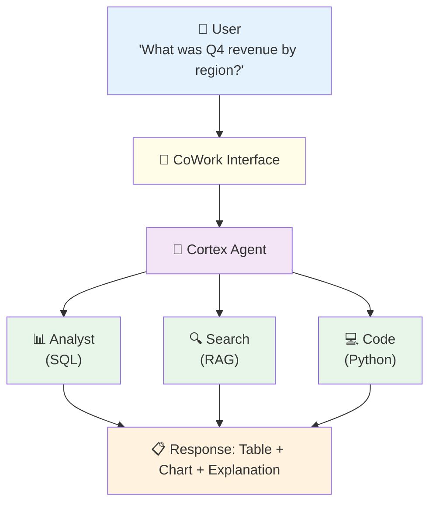

# 1.5 CoWork (formerly Snowflake Intelligence)

> **Exam Domain:** 1.0 — Snowflake for Gen AI Overview (18%)  
> **Exam Objective:** Understand the built-in agent experience in Snowsight

---

## What is CoWork?

Snowflake CoWork (formerly Snowflake Intelligence) is the **built-in natural language AI assistant** in the Snowsight UI. It provides a chat interface where business users interact with Cortex Agents without writing any code.

### Key Features

| Feature | Description |
|---------|-------------|
| **No-code interface** | Chat-based Q&A for business users |
| **Agent-powered** | Uses configured Cortex Agents behind the scenes |
| **Multi-tool** | Combines structured data (Analyst) + unstructured (Search) |
| **Visualizations** | Auto-generates charts from query results |
| **MCP connectors** | Connect external tools (Jira, Salesforce) |
| **Feedback** | Users can rate responses (thumbs up/down) |
| **Multi-language** | Supports English, French, German, Spanish, Italian, Portuguese, Arabic, Hindi, Chinese, Japanese, Korean |
| **Custom instructions** | Up to 2,000 characters of persistent context per session |
| **@ auto-complete** | Use `@table_name` in prompts for schema-aware suggestions |
| **Schema metadata** | Considers top ~10 tables/columns matching your question |

---

## How It Works



---

## Setup

### Creating an Agent for CoWork

```sql
-- 1. Create agent with tools
CREATE OR REPLACE AGENT my_db.my_schema.sales_agent
  MODEL = 'auto'
  TOOLS = (
    my_db.my_schema.revenue_analyst,   -- Cortex Analyst tool
    my_db.my_schema.policy_search       -- Cortex Search tool
  )
  INSTRUCTIONS = $$ You are a sales analytics assistant. Use revenue_analyst for financial questions and policy_search for company policy questions. $$;

-- 2. Grant usage so CoWork users can see this agent
GRANT USAGE ON AGENT my_db.my_schema.sales_agent TO ROLE business_users;

-- 3. For creating agents that appear in CoWork UI specifically:
USE ROLE SNOWFLAKE_INTELLIGENCE_ADMIN;
-- This role is required for CoWork-specific agent creation via the UI
```

### SQL DDL (Object Name Still Uses Legacy Syntax)

```sql
-- The SQL object type is still "SNOWFLAKE INTELLIGENCE" even though the product is CoWork
CREATE SNOWFLAKE INTELLIGENCE my_cowork_instance
  AGENT = my_db.my_schema.sales_agent;

SHOW SNOWFLAKE INTELLIGENCES;

ALTER SNOWFLAKE INTELLIGENCE my_cowork_instance SET
  AGENT = my_db.my_schema.updated_agent;
```

> ⚠️ **Exam Trap:** The SQL DDL uses `SNOWFLAKE INTELLIGENCE` as the object type (not "CoWork"). This is because the underlying SQL object wasn't renamed when the product was rebranded.

---

## Access Control

| Requirement | Details |
|-------------|---------|
| **Database role** | `SNOWFLAKE.CORTEX_USER` or `SNOWFLAKE.CORTEX_AGENT_USER` |
| **Object grant** | `USAGE` on the specific agent |
| **Admin role** | `SNOWFLAKE_INTELLIGENCE_ADMIN` for creating CoWork instances in UI |
| **Data access** | Respects the querying user's **default role** (not session role) |

---

## Limitations (Exam-Critical)

| Limitation | Detail |
|-----------|--------|
| **Schema metadata** | Considers only top ~10 tables/columns matching your question |
| **No data value access** | Cannot see actual data — only schema metadata |
| **No cross-database** | Doesn't automatically join across databases |
| **Single schema context** | Works best with one database + schema selected |
| **No DML/DDL** | Read-only by default — only generates SELECT queries |
| **Agent required** | CoWork won't work without at least one configured agent |
| **New table delay** | Newly created tables may take up to a few hours to appear |

---

## Deep Research

CoWork includes a **Deep Research** feature that performs multi-step autonomous investigation:

- Breaks complex questions into sub-tasks
- Executes multiple queries sequentially
- Synthesizes findings into a comprehensive answer
- Useful for exploratory analysis ("What's driving the revenue decline?")

---

## Billing

| View | What It Tracks |
|------|---------------|
| `SNOWFLAKE_INTELLIGENCE_USAGE_HISTORY` | Per-request token and credit breakdown for CoWork |
| `METERING_DAILY_HISTORY` (SERVICE_TYPE = 'SNOWFLAKE_INTELLIGENCE') | Daily credit aggregation |

```sql
-- Detailed per-request usage
SELECT * FROM SNOWFLAKE.ACCOUNT_USAGE.SNOWFLAKE_INTELLIGENCE_USAGE_HISTORY;

-- Daily credit totals
SELECT * FROM SNOWFLAKE.ACCOUNT_USAGE.METERING_DAILY_HISTORY
WHERE SERVICE_TYPE = 'SNOWFLAKE_INTELLIGENCE';
```

---

## Exam Tips

1. **CoWork = UI layer** on top of Cortex Agents (not a separate AI engine)
2. **No code required** for end users — pure chat interface
3. **Agent must exist** — CoWork doesn't work without a configured agent
4. **SNOWFLAKE_INTELLIGENCE_ADMIN** role needed for creating CoWork instances via UI
5. **SQL DDL** still uses `CREATE SNOWFLAKE INTELLIGENCE` (not "CREATE COWORK")
6. **Read-only** — only generates SELECT queries by default (no DML/DDL)
7. **Default role** used for data access (not session role)
8. **MCP connectors** can be added per-user in the sources panel
9. **Feedback mechanism** — thumbs up/down ratings improve agent quality
10. **Multi-language** — supports 11 languages for prompts

---

## References

- [Snowflake CoWork Reference](https://docs.snowflake.com/en/user-guide/snowflake-cortex/snowflake-cowork/reference)

---

<p align="center">
  <a href="./1.4_Cortex_Agents.md">&#8592; Previous: 1.4 Cortex Agents</a> &nbsp;&nbsp;|&nbsp;&nbsp;
  <a href="./README.md">&#127968; Domain Home</a> &nbsp;&nbsp;|&nbsp;&nbsp;
  <a href="../README.md">&#128218; Main Home</a> &nbsp;&nbsp;|&nbsp;&nbsp;
  <a href="./1.6_Cortex_Code.md">Next: 1.6 Cortex Code &#8594;</a>
</p>
