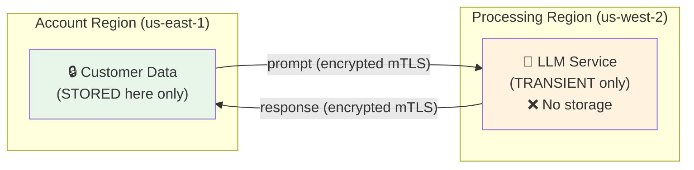

# 1.7 Cross-Region Inference

> **Exam Domain:** 1.0 — Snowflake for Gen AI Overview (18%)  
> **Exam Objective:** Understand cross-region inference configuration, security, and model access implications

---

## What is Cross-Region Inference?

Cross-region inference allows Snowflake to route AI model requests to **regions outside your account's home region** to access frontier models and additional capacity. Your **data remains stored only in your account region** — only the inference payload (prompt + response) transits transiently.

> 📘 **Key Terms**
>
> | Term | Definition |
> |------|-----------|
> | **Cross-Region Inference** | Routing LLM requests to other cloud regions for availability |
> | **Egress** | Data transfer cost when data crosses regions |
> | **CORTEX_ENABLED_CROSS_REGION** | The account/session parameter controlling this feature |
> | **Inference** | Running a trained model on new inputs |
>
> *See full [Glossary](../GLOSSARY.md)*

---

## CORTEX_ENABLED_CROSS_REGION Parameter

### Configuration Options

| Type | Value | Routing Behavior | Best For |
|------|-------|-----------------|----------|
| **Global** | `ANY_REGION` | Any Snowflake-supported region, any cloud | Maximum model access, throughput, resilience |
| **Cloud-specific** | `AWS_GLOBAL`, `AZURE_GLOBAL`, `GCP_GLOBAL` | Stay within designated cloud | Cloud-specific data requirements |
| **Regional** | `AWS_US`, `AWS_EU`, `AZURE_US`, `AZURE_EU` | Stay within cloud + geography | Cloud + geo requirements |
| **Disabled** | `DISABLED` | Account's home region only | Strict data sovereignty |

### Setting the Parameter

```sql
-- Enable maximum access (recommended)
ALTER ACCOUNT SET CORTEX_ENABLED_CROSS_REGION = 'ANY_REGION';

-- Restrict to AWS US regions
ALTER ACCOUNT SET CORTEX_ENABLED_CROSS_REGION = 'AWS_US';

-- Combine multiple regions
ALTER ACCOUNT SET CORTEX_ENABLED_CROSS_REGION = 'AWS_US,AZURE_US';

-- Disable (most restrictive)
ALTER ACCOUNT SET CORTEX_ENABLED_CROSS_REGION = 'DISABLED';

-- Check current setting
SHOW PARAMETERS LIKE 'CORTEX_ENABLED_CROSS_REGION' IN ACCOUNT;
```

---

## Access Control (Exam-Critical)

| Rule | Detail |
|------|--------|
| **Who can set it?** | Only **ACCOUNTADMIN** |
| **What level?** | Account level ONLY (not user or session) |
| **ORGADMIN?** | Cannot set this parameter |
| **Default (new accounts after March 9, 2026)** | `ANY_REGION` |
| **Default (existing accounts)** | Unset (effectively DISABLED) |

---

## Data Security



### Key Security Facts

- **Within same cloud provider** — Data stays on provider's private backbone (never public internet)
- **Across cloud providers** — Data uses Mutual TLS (mTLS) over public internet
- **No persistence** — Processing region does not store customer data
- **No egress charges** — Cross-region inference incurs no data egress fees

---

## What Requires Cross-Region?

| Feature | Requires Cross-Region? |
|---------|----------------------|
| Frontier models (Claude, GPT, Grok) | Yes (in most regions) |
| Cortex Code | Yes |
| Cortex AI Guardrails | Yes |
| Llama, Mistral (in native regions) | No |
| Cortex Search | Limited support |
| Embedding functions | Depends on model |

---

## Billing

- Credits consumed in the **requesting region** (your account region)
- No additional charges for cross-region routing
- No data egress charges
- Same per-token rates regardless of processing region

---

## Behavior Change Bundle (2026_06)

Starting with BCR bundle 2026_06, Snowflake sets the deployment default to the geography-scoped value for eligible commercial accounts that haven't already configured it:

- AWS US regions → `AWS_US`
- AWS EU regions → `AWS_EU`  
- Azure US regions → `AZURE_US`
- Azure EU regions → `AZURE_EU`

**Excluded:** Accounts with any explicit value set (including DISABLED), finance-sector, healthcare-sector, government, FedRAMP, and VPS accounts.

---

## Common Error

```
Error: "unknown model" or model not available
```

**Solution:** Enable cross-region inference:
```sql
ALTER ACCOUNT SET CORTEX_ENABLED_CROSS_REGION = 'ANY_REGION';
```

---

## Exam Tips

1. **Only ACCOUNTADMIN** can set CORTEX_ENABLED_CROSS_REGION (not ORGADMIN, not users)
2. **Account level only** — cannot be set per-session or per-user
3. **No data egress charges** — billing is same as local inference
4. **Data NOT stored** at processing region — only transient
5. **Required for Cortex Code** — DISABLED breaks it
6. **Default for new accounts** (after March 2026): `ANY_REGION`
7. **Same-cloud = private backbone**, cross-cloud = mTLS over internet
8. **Credits charged in requesting region** regardless of processing region

---

## References

- [Cross-Region Inference](https://docs.snowflake.com/en/user-guide/snowflake-cortex/cross-region-inference)
- [BCR 2026_06 Cross-Region Default](https://docs.snowflake.com/en/release-notes/bcr-bundles/2026_06/bcr-2376)
- [CORTEX_ENABLED_CROSS_REGION Parameter](https://docs.snowflake.com/en/sql-reference/parameters#cortex-enabled-cross-region)

---

<p align="center">
  <a href="./1.6a_CoCo_CoWork_Skills_Plugins.md">&#8592; Previous: 1.6a CoCo CoWork Skills</a> &nbsp;&nbsp;|&nbsp;&nbsp;
  <a href="./README.md">&#127968; Domain Home</a> &nbsp;&nbsp;|&nbsp;&nbsp;
  <a href="../README.md">&#128218; Main Home</a> &nbsp;&nbsp;|&nbsp;&nbsp;
  <a href="./1.8_Model_Registry_and_SPCS.md">Next: 1.8 Model Registry & SPCS &#8594;</a>
</p>
