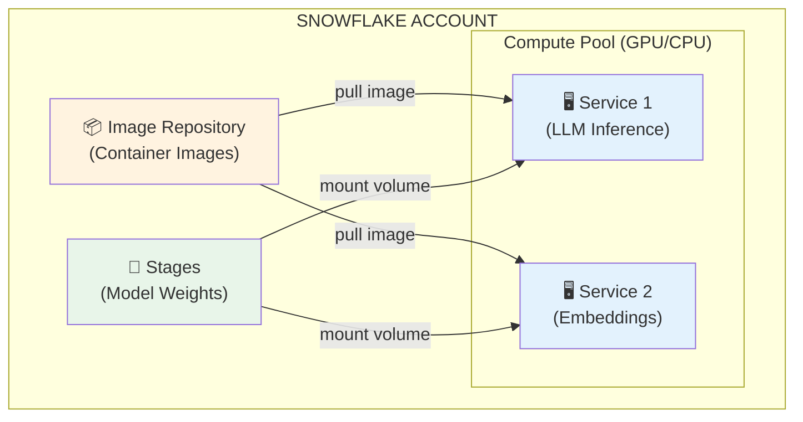

# 1.8 Model Registry and Snowpark Container Services (SPCS)

> **Exam Domain:** 1.0 — Snowflake for Gen AI Overview (18%)  
> **Exam Objective:** Understand how to register, version, and deploy custom models in Snowflake

---

## Snowflake Model Registry

The Model Registry allows you to **register, version, deploy, and manage** custom ML models within Snowflake's governed environment.

### Key Capabilities

| Feature | Description |
|---------|-------------|
| **Model versioning** | Track multiple versions of a model |
| **Model lineage** | Understand which data trained which model |
| **Model deployment** | Deploy as user-defined functions |
| **Framework support** | scikit-learn, PyTorch, XGBoost, Hugging Face, custom |
| **Governance** | RBAC on model objects, audit logging |

### Registering a Model

```python
from snowflake.ml.registry import Registry

reg = Registry(session=session, database_name="ML_DB", schema_name="MODELS")

# Log a scikit-learn model
model_version = reg.log_model(
    model_name="churn_predictor",
    version_name="v1",
    model=sklearn_model,
    conda_dependencies=["scikit-learn"],
    sample_input_data=X_train[:5]
)
```

### Deploying a Model

```python
# Deploy as a UDF for SQL access
model_version.deploy(
    deployment_name="predict_churn",
    target_method="predict",
    permanent=True
)

# Call from SQL
# SELECT predict_churn(features) FROM customer_data;
```

### Model Object SQL

```sql
-- List registered models
SHOW MODELS IN SCHEMA ml_db.models;

-- Describe a model
DESCRIBE MODEL ml_db.models.churn_predictor;

-- Drop a model version
ALTER MODEL churn_predictor DROP VERSION v1;
```

---

## Snowpark Container Services (SPCS)

SPCS enables running **custom containers** (Docker) within Snowflake's compute infrastructure — essential for deploying custom LLMs, fine-tuned models, or any workload requiring GPU.

### Architecture



### Key SPCS Components

| Component | Purpose |
|-----------|---------|
| **Compute Pool** | GPU/CPU resources for running containers |
| **Image Repository** | Stores Docker container images |
| **Service** | Running container instance |
| **Service Endpoint** | HTTP endpoint exposed by the service |
| **Specification File** | YAML defining container config |

### Creating a Compute Pool

```sql
CREATE COMPUTE POOL gpu_pool
  MIN_NODES = 1
  MAX_NODES = 3
  INSTANCE_FAMILY = GPU_NV_S;   -- NVIDIA GPU instance
```

### Instance Families

| Family | Type | Use Case |
|--------|------|----------|
| `CPU_X64_XS` through `CPU_X64_XL` | CPU | General ML, preprocessing |
| `GPU_NV_S` | 1x NVIDIA A10G | Small models, fine-tuning |
| `GPU_NV_M` | 1x NVIDIA A100 | Medium LLMs |
| `GPU_NV_L` | Multi-GPU | Large LLMs (70B+) |

### Deploying a Service

```sql
CREATE SERVICE llm_service
  IN COMPUTE POOL gpu_pool
  FROM SPECIFICATION $$
  spec:
    containers:
      - name: llm
        image: /my_db/my_schema/my_repo/vllm-server:latest
        resources:
          requests:
            nvidia.com/gpu: 1
          limits:
            nvidia.com/gpu: 1
        env:
          MODEL_NAME: "meta-llama/Llama-3.1-8B"
    endpoints:
      - name: inference
        port: 8000
        public: false
  $$;
```

### Calling an SPCS Service

```sql
-- Via service function
SELECT my_db.my_schema.llm_predict(input_text)
FROM my_table;

-- Via HTTP endpoint (within Snowflake)
SELECT SYSTEM$CALL_SERVICE(
  'llm_service',
  'inference',
  '/v1/completions',
  '{"prompt": "Hello", "max_tokens": 100}'
);
```

---

## When to Use What

| Scenario | Solution |
|----------|----------|
| Use pre-built Snowflake LLMs | AI_COMPLETE (no infrastructure) |
| Deploy scikit-learn/XGBoost | Model Registry (UDF deployment) |
| Fine-tune an open-source LLM | SPCS with GPU compute pool |
| Run a custom Docker container | SPCS |
| Need GPU inference | SPCS |
| Simple embedding generation | AI_EMBED (serverless) |

---

## Exam Tips

1. **Model Registry** = register + version + deploy traditional ML models as UDFs
2. **SPCS** = run custom containers (Docker) with GPU support
3. **AI Functions** (AI_COMPLETE etc.) need NO infrastructure — they're serverless
4. **SPCS billing** = per compute-hour (GPU instances), not per token
5. **Compute pools** define the hardware (GPU type, node count)
6. **Image repositories** store Docker images within Snowflake
7. **Service endpoints** expose HTTP APIs from containers
8. **Model Registry + SPCS** complement each other: Registry for governance, SPCS for compute

---

## References

- [Model Registry](https://docs.snowflake.com/en/developer-guide/snowflake-ml/model-registry/overview)
- [Snowpark Container Services](https://docs.snowflake.com/en/developer-guide/snowpark-container-services/overview)
- [Compute Pools](https://docs.snowflake.com/en/sql-reference/sql/create-compute-pool)

---

<p align="center">
  <a href="./1.7_Cross_Region_Inference.md">&#8592; Previous: 1.7 Cross-Region Inference</a> &nbsp;&nbsp;|&nbsp;&nbsp;
  <a href="./README.md">&#127968; Domain Home</a> &nbsp;&nbsp;|&nbsp;&nbsp;
  <a href="../README.md">&#128218; Main Home</a> &nbsp;&nbsp;|&nbsp;&nbsp;
  <a href="./1.8a_SPCS_Deep_Dive.md">Next: 1.8a SPCS Deep Dive &#8594;</a>
</p>
