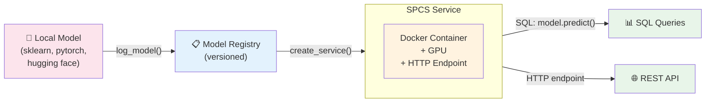
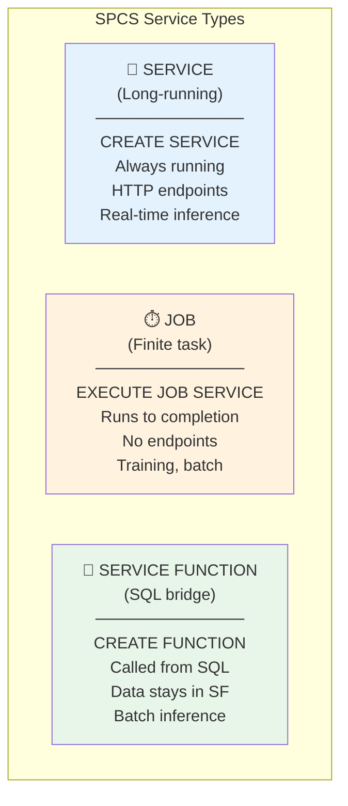

# 1.8a SPCS Deep Dive: Deployment Patterns and Model Registry

> **Exam Domain:** 1.0 and 2.0 (tested heavily in exam questions)  
> **Exam Objective:** Deploy custom models via Model Registry to SPCS with correct dependencies and privileges

---

## Model Registry → SPCS Deployment Flow



---

## log_model() Parameters (Exam-Critical)

```python
from snowflake.ml.registry import Registry

reg = Registry(session=session, database_name="ML_DB", schema_name="MODELS")

model_version = reg.log_model(
    model_name="my_model",                    # Required: model name
    version_name="v1",                         # Required: version
    model=trained_model,                       # Required: the model object
    
    # DEPENDENCIES (exam tests these heavily):
    conda_dependencies=["scikit-learn",        # Packages from conda-forge
                        "torch", 
                        "transformers"],
    pip_requirements=["sentence-transformers", # Packages ONLY from PyPI
                      "opencv-python"],
    
    # SIGNATURE INFERENCE (exam-critical):
    sample_input_data=X_train[:5],             # Required for signature
    
    # OPTIONAL:
    options={"cuda_version": "11.8"}           # For GPU models
)
```

### Key Rules

| Parameter | Purpose | When Required |
|-----------|---------|---------------|
| `model_name` | Name in registry | Always |
| `version_name` | Version identifier | Always |
| `model` | The trained model object | Always |
| `sample_input_data` | Infer input/output signature | Required for SPCS deployment |
| `conda_dependencies` | Packages from conda-forge | When model has dependencies |
| `pip_requirements` | Packages from PyPI only | When packages not in conda |
| `options={"cuda_version"}` | GPU CUDA version | For GPU-accelerated models |

> **Exam Tip:** `sample_input_data` is REQUIRED to infer the model signature. Without it, SPCS deployment fails.

---

## create_service() for SPCS Deployment

```python
model_version.create_service(
    service_name="my_inference_service",
    service_compute_pool="my_gpu_pool",        # Target compute pool
    image_build_compute_pool="build_pool",     # Pool for building container image
    gpu_requests=1,                             # Number of GPUs per instance
    num_workers=1,                              # Replicas
    max_batch_rows=64                           # Batch size for service functions
)
```

---

## Docker Image Push Workflow

### Registry URL Format
```
<orgname>-<account_name>.registry.snowflakecomputing.com
```

### Complete Workflow
```bash
# 1. Authenticate
docker login <orgname>-<account_name>.registry.snowflakecomputing.com \
  --username <user>

# 2. Tag local image
docker tag my_local_image:latest \
  <orgname>-<account_name>.registry.snowflakecomputing.com/<db>/<schema>/<repo>/my_image:v1

# 3. Push
docker push \
  <orgname>-<account_name>.registry.snowflakecomputing.com/<db>/<schema>/<repo>/my_image:v1
```

### Create Image Repository
```sql
CREATE IMAGE REPOSITORY my_inference_images;

-- Get the repository URL
SHOW IMAGE REPOSITORIES;
-- Returns: repository_url column with the full path
```

---

## SPCS Service YAML Specification

```yaml
spec:
  containers:
    - name: inference
      image: /db/schema/repo/my-llm:v1
      env:
        MODEL_PATH: "/models/weights"
        PORT: "8080"
        HF_TOKEN: "..."
      resources:
        requests:
          memory: "16Gi"
          nvidia.com/gpu: 1
        limits:
          memory: "32Gi"
          nvidia.com/gpu: 1
      volumeMounts:
        - name: model-weights
          mountPath: /models
  endpoints:
    - name: predict
      port: 8080
      public: true        # Externally accessible
  volumes:
    - name: model-weights
      source: "@model_stage"
      uid: 1000
      gid: 1000
  networkPolicyConfig:
    allowInternetEgress: true   # Required for external API calls
```

---

## Service Types in SPCS



---

## Required Privileges

| Object | Privilege | Purpose |
|--------|-----------|---------|
| Schema | `CREATE MODEL` | Log models to registry |
| Schema | `CREATE SERVICE` | Deploy SPCS services |
| Schema | `CREATE COMPUTE POOL` | Create compute resources |
| Image Repository | `READ` | Pull images for services |
| Compute Pool | `USAGE` | Use pool for services/jobs |
| Stage | `READ` | Mount volumes from stages |

```sql
-- Complete privilege setup for model deployment
GRANT CREATE MODEL ON SCHEMA ml_db.models TO ROLE deployer;
GRANT CREATE SERVICE ON SCHEMA ml_db.services TO ROLE deployer;
GRANT READ ON IMAGE REPOSITORY ml_db.images.my_repo TO ROLE deployer;
GRANT USAGE ON COMPUTE POOL my_gpu_pool TO ROLE deployer;
```

---

## Instance Families

| Family | GPU | Memory | Use Case |
|--------|-----|--------|----------|
| `CPU_X64_XS` | None | Low | Lightweight inference |
| `CPU_X64_S` | None | Medium | Medium models |
| `CPU_X64_M` | None | High | Large CPU models |
| `CPU_X64_L` | None | Very high | Memory-intensive |
| `GPU_NV_S` | 1× A10G (24GB) | Medium | Small LLMs, fine-tuning |
| `GPU_NV_M` | 1× A100 (40GB) | High | Medium LLMs (7B-13B) |
| `GPU_NV_L` | 4× A100 (160GB) | Very high | Large LLMs (70B+) |

---

## Exam Tips

1. **sample_input_data** is REQUIRED for log_model → SPCS deployment
2. **conda_dependencies** for conda-forge; **pip_requirements** for PyPI-only packages
3. **GPU specified at create_service**, not log_model
4. **Registry URL:** `<org>-<account>.registry.snowflakecomputing.com`
5. **READ on image repository** required to pull images
6. **SERVICE** = long-running (inference); **JOB** = finite (training)
7. **SERVICE FUNCTION** bridges SQL queries to SPCS services
8. **networkPolicyConfig.allowInternetEgress** for external access
9. **GPU_NV_S** = A10G; **GPU_NV_M** = A100; **GPU_NV_L** = 4×A100
10. **CREATE MODEL** privilege on schema required for log_model

---

## References

- [Model Registry](https://docs.snowflake.com/en/developer-guide/snowflake-ml/model-registry/overview)
- [Snowpark Container Services](https://docs.snowflake.com/en/developer-guide/snowpark-container-services/overview)
- [SPCS Service Specification](https://docs.snowflake.com/en/developer-guide/snowpark-container-services/specification-reference)
- [Compute Pools](https://docs.snowflake.com/en/sql-reference/sql/create-compute-pool)
- [Image Repositories](https://docs.snowflake.com/en/sql-reference/sql/create-image-repository)

---

<p align="center">
  <a href="./1.8_Model_Registry_and_SPCS.md">&#8592; Previous: 1.8 Model Registry & SPCS</a> &nbsp;&nbsp;|&nbsp;&nbsp;
  <a href="./README.md">&#127968; Domain Home</a> &nbsp;&nbsp;|&nbsp;&nbsp;
  <a href="../README.md">&#128218; Main Home</a> &nbsp;&nbsp;|&nbsp;&nbsp;
  <a href="./1.9_MCP_and_CKE.md">Next: 1.9 MCP & CKE &#8594;</a>
</p>
