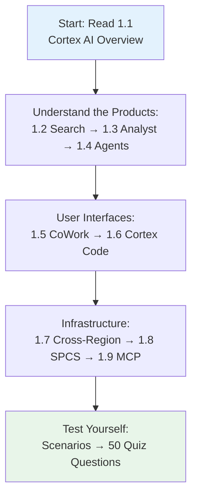
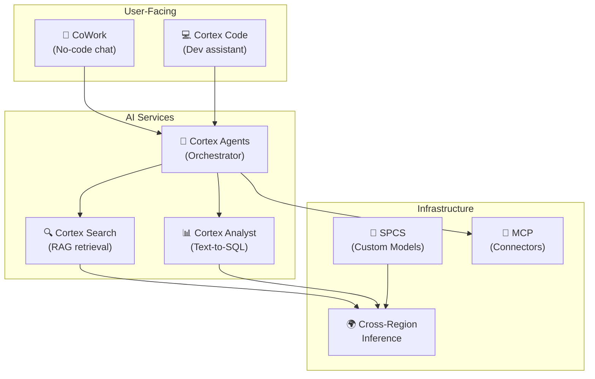

<h1 align="center">🏗️ Domain 1: Snowflake for Gen AI Overview</h1>

<p align="center">
  
  
  
</p>

---

> 💡 **Focus:** This domain tests your understanding of the Snowflake Cortex AI ecosystem — what each product does, how they relate, and when to use which component.

---

## 🎓 What You Need to Know

This domain is about **breadth, not depth**. The exam tests whether you can:

1. **Identify the right product** for a given use case (Search vs Analyst vs Agents vs CoWork)
2. **Understand architecture** — how components connect (e.g., Agents call Search + Analyst as tools)
3. **Know configuration** — key parameters like `CORTEX_ENABLED_CROSS_REGION` and `AUTO_SUSPEND`
4. **Distinguish deployment options** — serverless Cortex functions vs custom SPCS containers

### 📋 Prerequisites

Before studying this domain, you should understand:
- Basic Snowflake concepts (databases, schemas, roles, warehouses)
- What an LLM is and what "tokens" mean
- Basic SQL syntax

### 🧠 Study Approach



---

## 📚 Topics

| | # | Topic | File |
|---|---|-------|------|
| 🌐 | 1.1 | Snowflake Cortex Overview | [1.1_Snowflake_Cortex_Overview.md](./1.1_Snowflake_Cortex_Overview.md) |
| 🔍 | 1.2 | Cortex Search (Complete Reference) | [1.2_Cortex_Search.md](./1.2_Cortex_Search.md) |
| 🔍 | 1.2a | Cortex Search Advanced | [1.2a_Cortex_Search_Advanced.md](./1.2a_Cortex_Search_Advanced.md) |
| 📊 | 1.3 | Cortex Analyst & Semantic Views | [1.3_Cortex_Analyst.md](./1.3_Cortex_Analyst.md) |
| 🤖 | 1.4 | Cortex Agents | [1.4_Cortex_Agents.md](./1.4_Cortex_Agents.md) |
| 💬 | 1.5 | CoWork (formerly Snowflake Intelligence) | [1.5_Snowflake_Intelligence.md](./1.5_Snowflake_Intelligence.md) |
| 💻 | 1.6 | Cortex Code | [1.6_Cortex_Code.md](./1.6_Cortex_Code.md) |
| 🧩 | 1.6a | CoCo, CoWork, Skills & Plugins | [1.6a_CoCo_CoWork_Skills_Plugins.md](./1.6a_CoCo_CoWork_Skills_Plugins.md) |
| 🌍 | 1.7 | Cross-Region Inference | [1.7_Cross_Region_Inference.md](./1.7_Cross_Region_Inference.md) |
| 🐳 | 1.8 | Model Registry and SPCS | [1.8_Model_Registry_and_SPCS.md](./1.8_Model_Registry_and_SPCS.md) |
| 🐳 | 1.8a | SPCS Deep Dive | [1.8a_SPCS_Deep_Dive.md](./1.8a_SPCS_Deep_Dive.md) |
| 🔌 | 1.9 | MCP and Knowledge Extensions | [1.9_MCP_and_CKE.md](./1.9_MCP_and_CKE.md) |

---

## 🎯 Scenarios & Quiz

| | Resource | File |
|---|----------|------|
| 📋 | Scenarios & Decision Guide | [Scenarios_Domain1.md](./Scenarios_Domain1.md) |
| ✅ | Quiz (50 Questions) | [quiz/Questions_Domain1.md](./quiz/Questions_Domain1.md) |

---

## 🧭 Quick Decision Matrix

> **"Which product do I use?"** — The most common exam question pattern

```
┌─────────────────────────────────────────────────────────────────┐
│  🎯 USER NEED                │  ✅ USE THIS                      │
├──────────────────────────────┼───────────────────────────────────┤
│  Search unstructured docs    │  🔍 Cortex Search (RAG)           │
│  Query databases in NL       │  📊 Cortex Analyst (Semantic View)│
│  Both + reasoning            │  🤖 Cortex Agents (orchestrates)  │
│  No-code chat for users      │  💬 CoWork (ai.snowflake.com)     │
│  Help me write SQL           │  💻 Cortex Code                   │
│  Deploy custom model         │  🐳 SPCS + Model Registry         │
│  Access frontier models      │  🌍 Cross-Region Inference        │
│  Connect to Jira/Salesforce  │  🔌 MCP Connectors                │
│  Pre-built knowledge         │  📦 CKE from Marketplace          │
└──────────────────────────────┴───────────────────────────────────┘
```

---

## ⚠️ Key Exam Traps

> ❌ **Trap:** ORGADMIN can set CORTEX_ENABLED_CROSS_REGION  
> ✅ **Truth:** Only **ACCOUNTADMIN** can set it (account-level only)

> ❌ **Trap:** Larger warehouse = faster AI functions  
> ✅ **Truth:** **MEDIUM max** — larger doesn't improve performance

> ❌ **Trap:** Cross-region stores data at the processing region  
> ✅ **Truth:** Data transits **transiently** and is **NOT persisted**

> ❌ **Trap:** SEARCH_PREVIEW is for production queries  
> ✅ **Truth:** Testing only — 300KB limit, higher latency, no batch

---

## 📊 How Products Relate



---

<p align="center">
  <a href="../README.md">🏠 Main Home</a> &nbsp;&nbsp;|&nbsp;&nbsp;
  <a href="../2_Snowflake_Gen_AI_and_LLM_Functions/README.md">Next: Domain 2 →</a>
</p>
