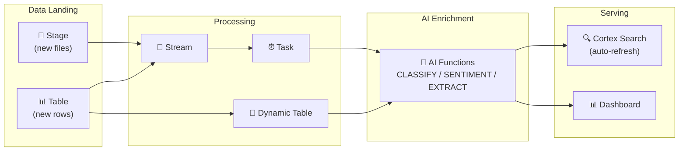

# 2.7 Cortex AI in Data Pipelines

> **Exam Domain:** 2.0 — Snowflake Gen AI Functions (38%)  
> **Exam Objective:** Integrate AI functions into automated data pipelines

---

## Dynamic Tables with AI Functions

Dynamic Tables provide **declarative, incremental** AI processing:

```sql
CREATE OR REPLACE DYNAMIC TABLE enriched_tickets
  TARGET_LAG = '1 hour'
  WAREHOUSE = ai_wh
AS
SELECT
    ticket_id,
    description,
    AI_CLASSIFY(description, ['Bug', 'Feature', 'Question', 'Billing']) AS category,
    AI_SENTIMENT(description) AS sentiment,
    CURRENT_TIMESTAMP() AS processed_at
FROM raw_tickets;
```

**Key advantages:**
- Automatic incremental refresh (only new/changed rows)
- Declarative — define the result, Snowflake manages the pipeline
- No explicit scheduling needed

---

## Streams + Tasks Pattern

For more control over AI processing:

```sql
-- Stream captures new rows
CREATE STREAM new_documents_stream ON TABLE raw_documents;

-- Task processes new documents
CREATE TASK process_documents
  WAREHOUSE = ai_wh
  SCHEDULE = '5 MINUTE'
  WHEN SYSTEM$STREAM_HAS_DATA('new_documents_stream')
AS
INSERT INTO processed_documents
SELECT
    doc_id,
    content,
    AI_COMPLETE('llama3.1-8b', 
        CONCAT('Summarize in 2 sentences: ', content)) AS summary,
    AI_CLASSIFY(content, ['Legal', 'Financial', 'Technical', 'HR']) AS category
FROM new_documents_stream;
```

---

## Incremental Document Processing

```sql
-- Process new PDF files as they land on stage
CREATE TASK parse_new_pdfs
  WAREHOUSE = ai_wh
  SCHEDULE = '10 MINUTE'
AS
INSERT INTO parsed_documents
SELECT
    RELATIVE_PATH,
    AI_PARSE_DOCUMENT(
        TO_FILE('@documents', RELATIVE_PATH),
        {'mode': 'LAYOUT'}
    ):content AS parsed_text
FROM DIRECTORY(@documents)
WHERE RELATIVE_PATH NOT IN (SELECT file_path FROM parsed_documents);
```

---

## Cortex Search Auto-Refresh

Cortex Search services refresh automatically via TARGET_LAG:

```sql
CREATE CORTEX SEARCH SERVICE doc_search
  ON content
  ATTRIBUTES category, date
  WAREHOUSE = search_wh
  TARGET_LAG = '1 hour'
AS (SELECT content, category, date FROM processed_documents);
-- Automatically refreshes as processed_documents changes
```

---

## Best Practices

| Practice | Why |
|----------|-----|
| Use MEDIUM warehouse or smaller | Larger doesn't help AI function performance |
| Batch with LIMIT during development | Avoid unexpected costs |
| Use TRY_COMPLETE for batch jobs | Don't let one error kill the pipeline |
| Dynamic tables for declarative pipelines | Simpler, auto-incremental |
| Streams + tasks for complex logic | More control over processing |
| Add error handling with CASE/NULLIF | Gracefully handle AI function failures |
| Monitor via CORTEX_AI_FUNCTIONS_USAGE_HISTORY | Track per-query token costs |

---

## Error Handling in Pipelines

```sql
-- Pattern 1: TRY_COMPLETE (returns NULL on error instead of failing)
SELECT
    doc_id,
    TRY_COMPLETE('llama3.1-8b', content) AS summary  -- NULL if error, pipeline continues
FROM documents;

-- Pattern 2: CASE with NULL check for pipeline resilience
INSERT INTO enriched_data
SELECT
    id,
    text,
    CASE 
        WHEN LENGTH(text) > 10 THEN AI_SENTIMENT(text)
        ELSE NULL  -- Skip empty/tiny texts
    END AS sentiment
FROM raw_data;
```

---

## Pipeline Architecture Diagram



---

## Cost Optimization for Pipelines

| Strategy | Savings |
|----------|---------|
| **Use smaller models** for classification (llama3.1-8b) | 10-50x cheaper than large models |
| **Process only deltas** (streams/incremental DT) | Pay only for new data |
| **page_filter in AI_PARSE_DOCUMENT** | Parse only needed pages |
| **Batch similar operations** | Reduce per-call overhead |
| **Set TARGET_LAG appropriately** | Don't refresh more than needed |

---

## Exam Tips

1. **Dynamic tables** = simplest way to add AI to pipelines (declarative)
2. **Streams + tasks** = event-driven AI processing
3. **TARGET_LAG** controls freshness for both dynamic tables and Cortex Search
4. **TRY_COMPLETE** prevents batch pipeline failures
5. **MEDIUM warehouse** recommended for AI functions
6. **SYSTEM$STREAM_HAS_DATA** triggers task only when new data exists

---

<p align="center">
  <a href="./2.6_Chat_Interfaces_and_Streamlit.md">&#8592; Previous: 2.6 Chat Interfaces & Streamlit</a> &nbsp;&nbsp;|&nbsp;&nbsp;
  <a href="./README.md">&#127968; Domain Home</a> &nbsp;&nbsp;|&nbsp;&nbsp;
  <a href="../README.md">&#128218; Main Home</a> &nbsp;&nbsp;|&nbsp;&nbsp;
  <a href="./2.8_Third_Party_Models_SPCS.md">Next: 2.8 Third-Party Models SPCS &#8594;</a>
</p>
