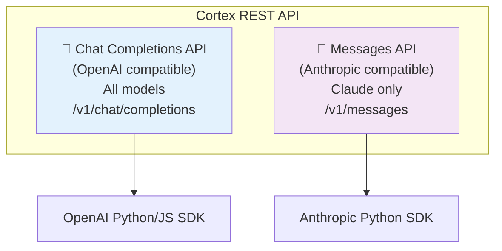
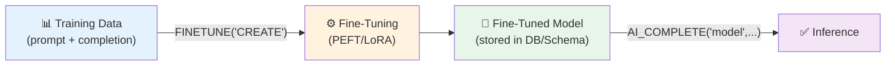

# 2.8a Cortex REST API and Fine-Tuning Deep Dive

> **Exam Domain:** 2.0 — Snowflake Gen AI Functions (38%)  
> **Exam Objective:** Understand API access patterns, fine-tuning workflows, and advanced inference features

---

## Cortex REST API

The Cortex REST API provides **lower-latency** access to LLMs via HTTP, supporting two industry-standard specifications:



### When to Use REST API vs SQL Functions

| Scenario | Use | Why |
|----------|-----|-----|
| Real-time chatbot | **REST API** | Lower latency, streaming support |
| Batch data processing | **SQL (AI_COMPLETE)** | Integrates with pipelines, GROUP BY |
| External application | **REST API** | Standard HTTP, SDK support |
| Snowflake worksheet | **SQL** | Direct execution |
| Mobile/web app backend | **REST API** | Industry-standard SDKs |
| Dynamic table enrichment | **SQL** | Declarative pipeline |

### Authentication

- **PAT** (Programmatic Access Token) — recommended
- **JWT** (JSON Web Token) — key-pair authentication
- **OAuth** — external OAuth providers

### Authorization Role

- Requires `SNOWFLAKE.CORTEX_USER` OR `SNOWFLAKE.CORTEX_REST_API_USER`
- `CORTEX_REST_API_USER` = **least-privilege for REST API only**
- Uses the user's **default role** (not session role)

```sql
-- Grant REST API-only access
GRANT DATABASE ROLE SNOWFLAKE.CORTEX_REST_API_USER TO ROLE api_role;
ALTER USER api_user SET DEFAULT_ROLE = api_role;
```

### Key REST API Features

| Feature | Chat Completions | Messages API |
|---------|-----------------|--------------|
| Streaming | ✓ (`stream: true`) | ✓ (`stream: true`) |
| Tool Calling | ✓ (OpenAI format) | ✓ (Anthropic format) |
| Structured Output | ✓ (`response_format`) | ✓ (`output_config`) |
| Image Input | ✓ (base64 data URL) | ✓ (source block) |
| Prompt Caching | ✓ (implicit for OpenAI, explicit for Claude) | ✓ (explicit `cache_control`) |
| Thinking/Reasoning | ✓ (`reasoning` object) | ✓ (`thinking` parameter) |

### Prompt Caching Details (Exam-Critical)

| Aspect | OpenAI Models | Claude Models |
|--------|--------------|---------------|
| Activation | **Implicit/automatic** | **Explicit** (`cache_control` on content blocks) |
| Threshold | Prompts with **1024+ tokens** auto-cached | Must add `cache_control: {"type": "ephemeral"}` |
| TTL | Managed by provider | **5-minute TTL** (evicted if not accessed) |
| Max breakpoints | N/A (automatic) | **Maximum 4 cache breakpoints per request** |
| Code change needed | None | Yes — add `cache_control` field |

### Tool Calling Mechanism (Exam-Critical)

Tool calling is a **multi-step process** — the model does NOT execute tools itself:

```
Step 1: You send request with tools list
Step 2: Model returns tool_calls (function name + arguments) — DOES NOT EXECUTE
Step 3: YOU execute the tool locally with the provided arguments
Step 4: You send the tool result back to the model
Step 5: Model generates final response incorporating the tool result
```

Supported for: OpenAI and Claude models only (not Llama/Mistral/DeepSeek).

### REST API Billing

- Billed in **dollars per million tokens** (not Snowflake credits)
- Tracked via `CORTEX_REST_API_USAGE_HISTORY` view
- Rate limits: per-model TPM (tokens/min) and RPM (requests/min)

```sql
-- Monitor REST API usage
SELECT * FROM SNOWFLAKE.ACCOUNT_USAGE.CORTEX_REST_API_USAGE_HISTORY
WHERE START_TIME > DATEADD(day, -7, CURRENT_TIMESTAMP());

-- Check rate limits
SELECT * FROM SNOWFLAKE.ACCOUNT_USAGE.CORTEX_REST_API_RATE_LIMIT_POLICIES;
```

---

## Cortex Fine-Tuning Deep Dive

### Architecture



### Supported Base Models for Fine-Tuning

| Model | Context | Input (prompt) | Output (completion) | 3-epoch row limit |
|-------|---------|---------------|--------------------|--------------------|
| llama3-8b | 8K | 6K | 2K | 62K rows |
| llama3-70b | 8K | 6K | 2K | 7K rows |
| llama3.1-8b | 24K | 20K | 4K | 50K rows |
| llama3.1-70b | 8K | 6K | 2K | 4.5K rows |
| mistral-7b | 32K | 28K | 4K | 15K rows |
| mixtral-8x7b | 32K | 28K | 4K | 9K rows |

### Fine-Tuning SQL Workflow

```sql
-- 1. Prepare training data (MUST have 'prompt' and 'completion' columns)
CREATE TABLE training_data AS
SELECT 
    question AS prompt, 
    ideal_answer AS completion 
FROM curated_examples;

-- 2. Start fine-tuning job
SELECT SNOWFLAKE.CORTEX.FINETUNE(
    'CREATE',
    'my_custom_model',          -- output model name
    'llama3.1-8b',              -- base model
    'SELECT prompt, completion FROM training_data',
    'SELECT prompt, completion FROM validation_data'
);
-- Returns: job ID (e.g., 'ft_abc123...')

-- 3. Check job status
SELECT SNOWFLAKE.CORTEX.FINETUNE('DESCRIBE', 'ft_abc123...');

-- 4. List all fine-tuning jobs
SELECT SNOWFLAKE.CORTEX.FINETUNE('SHOW');

-- 5. Use fine-tuned model (same as any model)
SELECT AI_COMPLETE('my_custom_model', 'Your prompt here');

-- 6. Cancel a running job
SELECT SNOWFLAKE.CORTEX.FINETUNE('CANCEL', 'ft_abc123...');
```

### Fine-Tuning arctic-extract (Document Extraction)

Different data format — uses FILE, Prompt, Response columns with Dataset objects:

```sql
-- Create dataset
CREATE DATASET my_extract_dataset;

ALTER DATASET my_extract_dataset ADD VERSION 'v1' FROM (
    SELECT 
        FL_GET_STAGE(f) || '/' || FL_GET_RELATIVE_PATH(f) AS "file",
        p AS "prompt",
        r AS "response"
    FROM training_table
);

-- Fine-tune arctic-extract
SELECT SNOWFLAKE.CORTEX.FINETUNE(
    'CREATE',
    '@db.schema.my_extract_model',
    'arctic-extract',
    'snow://dataset/db.schema.my_extract_dataset/versions/v1'
);

-- Use fine-tuned extraction model
SELECT AI_EXTRACT(
    model => 'db.schema.my_extract_model',
    file => TO_FILE('@stage', 'doc.pdf')
);
```

### Fine-Tuning Access Control

| Privilege | Object | Purpose |
|-----------|--------|---------|
| `CREATE MODEL` | Schema | Save fine-tuned model |
| `USAGE` | Database | Read training data |
| `SNOWFLAKE.CORTEX_USER` | Database role | Call FINETUNE function |

### When to Fine-Tune vs Other Approaches

```
┌─────────────────────────────────────────────────────────┐
│           DECISION: How to improve LLM quality?          │
├─────────────────────────────────────────────────────────┤
│                                                           │
│  Need: Better prompts/instructions?                       │
│  → PROMPT ENGINEERING (free, instant)                     │
│                                                           │
│  Need: Answer from your documents?                        │
│  → RAG with CORTEX SEARCH (no training)                   │
│                                                           │
│  Need: Domain-specific behavior/tone?                     │
│  → FINE-TUNING (training cost, but better at task)        │
│                                                           │
│  Need: Full custom model architecture?                    │
│  → SPCS (most control, most cost)                         │
│                                                           │
└─────────────────────────────────────────────────────────┘
```

---

## Legacy Function Mapping (Exam Reference)

| Legacy (SNOWFLAKE.CORTEX.*) | Current (AI_*) | Notes |
|-----------------------------|----------------|-------|
| COMPLETE | AI_COMPLETE | Same functionality |
| TRY_COMPLETE | TRY_COMPLETE | Unchanged |
| CLASSIFY_TEXT | AI_CLASSIFY | Renamed |
| EMBED_TEXT_768 | AI_EMBED (768d model) | Use AI_EMBED now |
| EMBED_TEXT_1024 | AI_EMBED (1024d model) | Use AI_EMBED now |
| EXTRACT_ANSWER | AI_EXTRACT | Different syntax |
| ENTITY_SENTIMENT | AI_SENTIMENT (with entities) | Being deprecated EOY 2026 |
| SENTIMENT | AI_SENTIMENT (no entities) | Returns float |
| SUMMARIZE | SUMMARIZE | Unchanged |
| SUMMARIZE_AGG | AI_SUMMARIZE_AGG | Renamed |
| TRANSLATE | AI_TRANSLATE | Renamed |
| PARSE_DOCUMENT | AI_PARSE_DOCUMENT | Renamed |
| COUNT_TOKENS | AI_COUNT_TOKENS | Renamed |

> **Exam Tip:** Both namespaces are valid. The exam uses both `SNOWFLAKE.CORTEX.*` and `AI_*` names.

---

## Exam Tips

1. **REST API = lower latency** than SQL for real-time applications
2. **Two API specs**: Chat Completions (all models) and Messages (Claude only)
3. **CORTEX_REST_API_USER** = least-privilege for REST API access
4. **REST API uses user's default role** (not session role)
5. **REST billed in dollars** (not credits) via CORTEX_REST_API_USAGE_HISTORY
6. **Fine-tuning requires 'prompt' and 'completion' columns** exactly
7. **FINETUNE operations**: CREATE, SHOW, DESCRIBE, CANCEL
8. **Fine-tuned models called with AI_COMPLETE** using the model name
9. **arctic-extract fine-tuning** uses Dataset objects (different format)
10. **Cross-region inference does NOT support fine-tuned models** — must use same region
11. **CREATE MODEL privilege** required to save fine-tuned models
12. **Prompt caching**: OpenAI = implicit (auto); Claude = explicit (`cache_control`)
13. **Rate limits**: per-model TPM and RPM; check CORTEX_REST_API_RATE_LIMIT_POLICIES

---

## References

- [Cortex REST API](https://docs.snowflake.com/en/user-guide/snowflake-cortex/cortex-rest-api)
- [Fine-Tuning](https://docs.snowflake.com/en/user-guide/snowflake-cortex/cortex-finetuning)
- [Fine-Tuning arctic-extract](https://docs.snowflake.com/en/user-guide/snowflake-cortex/arctic-extract-finetuning)
- [FINETUNE Function](https://docs.snowflake.com/en/sql-reference/functions/finetune-snowflake-cortex)

---

<p align="center">
  <a href="./2.8_Third_Party_Models_SPCS.md">&#8592; Previous: 2.8 Third-Party Models SPCS</a> &nbsp;&nbsp;|&nbsp;&nbsp;
  <a href="./README.md">&#127968; Domain Home</a> &nbsp;&nbsp;|&nbsp;&nbsp;
  <a href="../README.md">&#128218; Main Home</a> &nbsp;&nbsp;|&nbsp;&nbsp;
  <a href="./2.9_Performance_Considerations.md">Next: 2.9 Performance Considerations &#8594;</a>
</p>
