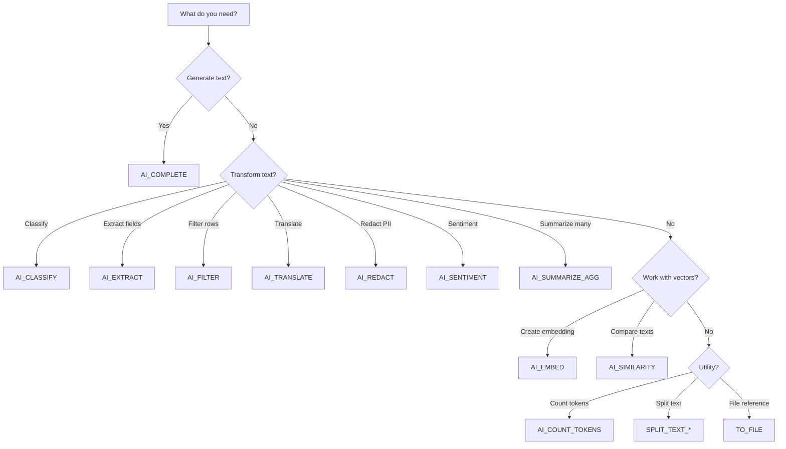

<h1 align="center">⚡ Domain 2: Snowflake Gen AI Functions</h1>

  
  
  

---

> ⚠️ **This is the LARGEST domain at 38%.** You must know every function's syntax, parameters, return types, and appropriate use cases.

---

## 🎓 What You Need to Know

This domain is about **depth**. The exam will present scenarios and ask which function to use, what its return type is, or how to structure the call. You need to:

1. **Know every function's signature** — parameters, return types, and billing model
2. **Choose the right function** for a use case (e.g., "classify tickets" → AI_CLASSIFY, not AI_COMPLETE)
3. **Understand structured output** — response_format, JSON mode, and schema enforcement
4. **Know model selection** — when to pick small vs large models, and cost implications
5. **Understand pipelines** — how to use AI functions in Dynamic Tables, Streams+Tasks, and Streamlit

### 📋 Prerequisites

- Familiarity with Snowflake SQL (SELECT, UDF, LATERAL FLATTEN)
- Understanding of Domain 1 concepts (what Cortex AI is)
- Basic understanding of tokens and LLM behavior

### 🧠 Study Approach

| Step | What to Do | Why |
|------|-----------|-----|
| 1 | Read 2.1 (AI_COMPLETE) | Foundation — all other functions build on this |
| 2 | Read 2.2 (Task-Specific) | Learn CLASSIFY, EXTRACT, FILTER, SENTIMENT — high exam frequency |
| 3 | Read 2.3 (Vectors) | Embeddings and similarity are heavily tested |
| 4 | Read 2.4 (Helpers) | Know what's free vs what costs tokens |
| 5 | Read 2.5–2.7 (Patterns) | Integration patterns are common scenario questions |
| 6 | Read 2.8–2.9 (Advanced) | REST API, fine-tuning, model selection |
| 7 | Do all 60 quiz questions | Identify gaps, revisit weak areas |

---

## 📚 Topics

| | # | Topic | File |
|---|---|-------|------|
| 🧠 | 2.1 | AI_COMPLETE and General Functions | [2.1_AI_Complete_and_General_Functions.md](./2.1_AI_Complete_and_General_Functions.md) |
| 🏷️ | 2.2 | Task-Specific Functions | [2.2_Task_Specific_Functions.md](./2.2_Task_Specific_Functions.md) |
| 📐 | 2.3 | Vector Functions | [2.3_Vector_Functions.md](./2.3_Vector_Functions.md) |
| 🔧 | 2.4 | Helper Functions | [2.4_Helper_Functions.md](./2.4_Helper_Functions.md) |
| 📈 | 2.5 | Data Analysis Patterns | [2.5_Data_Analysis_Patterns.md](./2.5_Data_Analysis_Patterns.md) |
| 💬 | 2.6 | Chat Interfaces and Streamlit | [2.6_Chat_Interfaces_and_Streamlit.md](./2.6_Chat_Interfaces_and_Streamlit.md) |
| 🔄 | 2.7 | Cortex in Data Pipelines | [2.7_Cortex_in_Data_Pipelines.md](./2.7_Cortex_in_Data_Pipelines.md) |
| 🐳 | 2.8 | Third-Party Models (SPCS) | [2.8_Third_Party_Models_SPCS.md](./2.8_Third_Party_Models_SPCS.md) |
| 🌐 | 2.8a | REST API and Fine-Tuning Deep Dive | [2.8a_REST_API_and_Fine_Tuning.md](./2.8a_REST_API_and_Fine_Tuning.md) |
| ⚙️ | 2.9 | Performance and Model Selection | [2.9_Performance_Considerations.md](./2.9_Performance_Considerations.md) |

---

## 🎯 Scenarios & Quiz

| | Resource | File |
|---|----------|------|
| 📋 | Scenarios & Function Selection Guide | [Scenarios_Domain2.md](./Scenarios_Domain2.md) |
| ✅ | Quiz (60 Questions) | [quiz/Questions_Domain2.md](./quiz/Questions_Domain2.md) |

---

## 📝 Function Quick Reference

### 🧠 Generative (Input + Output Tokens Billed)

| Function | What It Does | Returns |
|----------|-------------|---------|
| `AI_COMPLETE` | General completion (text/image/audio/video) | VARCHAR or JSON |
| `AI_CLASSIFY` | Classify into categories | VARCHAR (label) |
| `AI_EXTRACT` | Extract structured fields | OBJECT (JSON) |
| `AI_FILTER` | Boolean condition check | BOOLEAN |
| `AI_AGG` | Aggregate insight across rows | VARCHAR |
| `AI_SENTIMENT` | Sentiment analysis | FLOAT or OBJECT |
| `AI_SUMMARIZE_AGG` | Multi-row summary | VARCHAR |
| `SUMMARIZE` | Single-text summary | VARCHAR |
| `AI_TRANSLATE` | Translation | VARCHAR |
| `AI_REDACT` | PII removal | VARCHAR |
| `AI_TRANSCRIBE` | Speech-to-text | OBJECT (JSON) |

### 📐 Embedding (Input Tokens Only)

| Function | Returns | Use Case |
|----------|---------|----------|
| `AI_EMBED` | VECTOR | Text/image embeddings |
| `AI_MULTI_EMBED` | OBJECT | Video embeddings |
| `AI_SIMILARITY` | FLOAT | Similarity score |

### 🔧 Helpers (Compute Only / Free)

| Function | Returns | Cost |
|----------|---------|------|
| `AI_COUNT_TOKENS` | INT | Compute only |
| `SPLIT_TEXT_RECURSIVE_CHARACTER` | ARRAY | Compute only |
| `TO_FILE` | FILE | Free |
| `PROMPT` | OBJECT | Free |
| `TRY_COMPLETE` | VARCHAR/NULL | Same as AI_COMPLETE |

---

## ⚠️ Key Exam Traps

> ❌ **Trap:** AI_SENTIMENT always returns a float  
> ✅ **Truth:** Without entities → float. **With entities array → OBJECT with categories**

> ❌ **Trap:** AI_AGG is limited by context window  
> ✅ **Truth:** AI_AGG has **no context window limit** — processes in batches

> ❌ **Trap:** AI_COUNT_TOKENS has token-based charges  
> ✅ **Truth:** Only **compute cost** (warehouse) — no token charges

> ❌ **Trap:** response_format is just a suggestion to the model  
> ✅ **Truth:** It **guarantees** schema compliance — every token validated

> ❌ **Trap:** Fine-tuned models work across regions  
> ✅ **Truth:** Cross-region inference does **NOT** support fine-tuned models

---

## 💡 Mental Model: How to Pick the Right Function

---

  <a href="../1_Snowflake_for_Gen_AI_Overview/README.md">← Domain 1</a> &nbsp;&nbsp;|&nbsp;&nbsp;
  <a href="../README.md">🏠 Main Home</a> &nbsp;&nbsp;|&nbsp;&nbsp;
  <a href="../3_Snowflake_Gen_AI_Governance/README.md">Domain 3 →</a>

