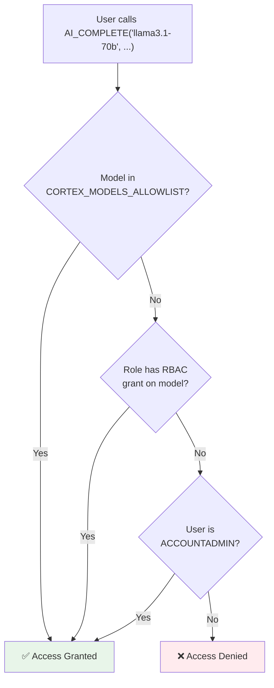

# 3.1 Model Access Controls

> **Exam Domain:** 3.0 — Snowflake Gen AI Governance (29%)  
> **Exam Objective:** Implement model-level access controls using RBAC and allowlists

---

## Two Mechanisms for Model Access

### 1. Role-Based Access Control (RBAC) — Recommended

Model objects live in `SNOWFLAKE.MODELS` schema. Application roles control access:

```sql
-- Refresh model objects (daily auto-refresh, or on-demand)
CALL SNOWFLAKE.MODELS.CORTEX_BASE_MODELS_REFRESH();

-- View available models
SHOW MODELS IN SNOWFLAKE.MODELS;

-- View model application roles
SHOW APPLICATION ROLES LIKE 'CORTEX-MODEL%' IN APPLICATION SNOWFLAKE;

-- Grant specific model access
GRANT APPLICATION ROLE SNOWFLAKE."CORTEX-MODEL-ROLE-LLAMA3.1-70B" TO ROLE analyst_role;

-- Grant access to ALL models
GRANT APPLICATION ROLE SNOWFLAKE."CORTEX-MODEL-ROLE-ALL" TO ROLE data_science_role;

-- Use model via object identifier
SELECT AI_COMPLETE('SNOWFLAKE.MODELS."LLAMA3.1-70B"', 'Hello');
-- Or simply (auto-resolves to SNOWFLAKE.MODELS):
SELECT AI_COMPLETE('llama3.1-70b', 'Hello');
```

### 2. Account-Level Allowlist (Legacy — Being Deprecated)

```sql
-- Allow specific models only
ALTER ACCOUNT SET CORTEX_MODELS_ALLOWLIST = 'mistral-large2,llama3.1-70b';

-- Allow all models
ALTER ACCOUNT SET CORTEX_MODELS_ALLOWLIST = 'All';

-- Block all (only RBAC-granted models work)
ALTER ACCOUNT SET CORTEX_MODELS_ALLOWLIST = 'None';
```

> **Exam Alert:** CORTEX_MODELS_ALLOWLIST is being deprecated (August 2026). Migrate to RBAC.

---

## How RBAC and Allowlist Interact

Access is granted if **EITHER** mechanism permits it:



> **Key:** `Access = (Model in Allowlist) OR (Role has RBAC grant) OR (ACCOUNTADMIN)`

Access denied ONLY if all three checks fail.

---

## Revoking Access (Locking Down)

```sql
-- Scenario: Restrict to ONLY specific models via RBAC

-- Step 1: Remove allowlist (no longer allows by model name)
ALTER ACCOUNT SET CORTEX_MODELS_ALLOWLIST = 'None';

-- Step 2: Revoke CORTEX-MODEL-ROLE-ALL from PUBLIC (if previously granted)
REVOKE APPLICATION ROLE SNOWFLAKE."CORTEX-MODEL-ROLE-ALL" FROM ROLE PUBLIC;

-- Step 3: Grant only specific models to specific roles
GRANT APPLICATION ROLE SNOWFLAKE."CORTEX-MODEL-ROLE-LLAMA3.1-8B" TO ROLE junior_analyst;
GRANT APPLICATION ROLE SNOWFLAKE."CORTEX-MODEL-ROLE-LLAMA3.3-70B" TO ROLE senior_analyst;
GRANT APPLICATION ROLE SNOWFLAKE."CORTEX-MODEL-ROLE-ALL" TO ROLE data_science_role;

-- Step 4: Verify restriction works
USE ROLE junior_analyst;
SELECT AI_COMPLETE('llama3.3-70b', 'test');  -- Should FAIL (no access)
SELECT AI_COMPLETE('llama3.1-8b', 'test');   -- Should SUCCEED
```

---

## Cross-Region + Model Access Interaction

| Scenario | Result |
|----------|--------|
| Model available locally + RBAC granted | ✅ Works |
| Model NOT available locally + cross-region ON + RBAC granted | ✅ Works (routes to another region) |
| Model NOT available locally + cross-region OFF | ❌ Fails regardless of RBAC |
| RBAC granted + allowlist = 'None' | ✅ Works (RBAC alone is sufficient) |
| Allowlist includes model + no RBAC grant | ✅ Works (allowlist alone is sufficient) |

---

## Migration from Allowlist to RBAC

```sql
-- Step 1: Check current allowlist
SHOW PARAMETERS LIKE 'CORTEX_MODELS_ALLOWLIST' IN ACCOUNT;

-- Step 2: Grant equivalent RBAC roles
GRANT APPLICATION ROLE SNOWFLAKE."CORTEX-MODEL-ROLE-ALL" TO ROLE PUBLIC;

-- Step 3: Verify (use non-ACCOUNTADMIN role)
USE ROLE PUBLIC;
SELECT AI_COMPLETE('llama3.1-70b', 'test');

-- Step 4: Disable allowlist
ALTER ACCOUNT SET CORTEX_MODELS_ALLOWLIST = 'None';
```

---

## Important Rules

| Rule | Detail |
|------|--------|
| ACCOUNTADMIN always has access | Regardless of allowlist or RBAC |
| Secondary roles matter | If ACCOUNTADMIN is secondary role, all models accessible |
| Model names are case-sensitive | Use lowercase in allowlist ('mistral-large2') |
| Quoted identifiers in RBAC | `SNOWFLAKE."CORTEX-MODEL-ROLE-LLAMA3.1-70B"` |
| Access ≠ availability | Model must also be regionally available |
| Check availability | `SHOW CORTEX BASE MODELS IN SCHEMA SNOWFLAKE.MODELS;` |

---

## Exam Tips

1. **RBAC is the recommended approach** (allowlist being deprecated)
2. **CORTEX-MODEL-ROLE-ALL** grants access to all current and future models
3. **ACCOUNTADMIN always has access** regardless of restrictions
4. **Secondary roles can obscure permissions** — use `USE SECONDARY ROLES NONE` to test
5. **Access granted if EITHER** RBAC or allowlist permits it
6. **Only ACCOUNTADMIN** can set CORTEX_MODELS_ALLOWLIST
7. **Model names case-sensitive** in allowlist (lowercase)

---

## References

- [Model Access Controls](https://docs.snowflake.com/en/user-guide/snowflake-cortex/aisql-privileges-and-access)

---

<p align="center">
  <a href="./README.md">&#127968; Domain Home</a> &nbsp;&nbsp;|&nbsp;&nbsp;
  <a href="../README.md">&#128218; Main Home</a> &nbsp;&nbsp;|&nbsp;&nbsp;
  <a href="./3.1a_Guardrails_and_Advanced_Governance.md">Next: 3.1a Guardrails & Advanced Governance &#8594;</a>
</p>
