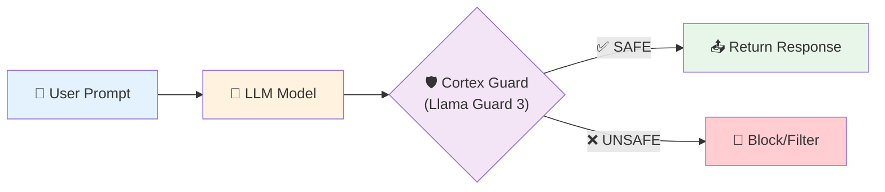
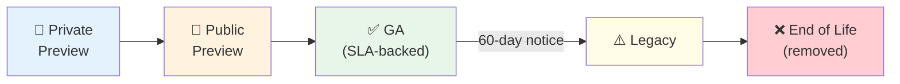

# 3.1a Cortex Guardrails and Advanced Governance

> **Exam Domain:** 3.0 — Snowflake Gen AI Governance (29%)  
> **Exam Objective:** Configure safety controls, manage model lifecycle, and understand provisioned throughput

---

## Cortex AI Guardrails

### Function-Level (model_parameters)

```sql
SELECT AI_COMPLETE(
    'llama3.1-70b',
    user_input,
    model_parameters => {'guardrails': TRUE}
);
```

### Account-Level (AI_SETTINGS)

Configure guardrails as default for all AI function calls:

```sql
-- Enable guardrails account-wide
ALTER ACCOUNT SET AI_SETTINGS = '{
    "guardrails": {
        "enabled": true,
        "mode": "block"
    }
}';
```

### How Guardrails Work



**Categories filtered:**
- Violence and criminal activity
- Hate speech and discrimination
- Sexual content
- Self-harm
- Firearms and weapons
- Regulated substances

**Cost:** Additional input tokens charged (based on AI_COMPLETE output size)

---

## SHOW CORTEX BASE MODELS

Check available models and their lifecycle status:

```sql
-- See all available models in your account
SHOW CORTEX BASE MODELS IN SCHEMA SNOWFLAKE.MODELS;
```

Returns: model name, status (GA/Preview/Legacy/EOL), availability, context window.

### Model Lifecycle



| Status | Guarantee | Deprecation Notice |
|--------|-----------|-------------------|
| Private Preview | None | None |
| Public Preview | None | None |
| Generally Available (GA) | SLA-backed | 60 days minimum |
| Legacy | Support continues during notice | Being removed |
| End of Life | None | Removed |

---

## Provisioned Throughput

Reserved capacity for predictable, high-volume workloads:

### When to Use

| Scenario | Billing Model |
|----------|--------------|
| Unpredictable/bursty usage | **Per-token** (default) |
| Steady high-volume production | **Provisioned throughput** |
| Guaranteed latency SLA needed | **Provisioned throughput** |
| Development/testing | **Per-token** |

### Monitoring

```sql
SELECT * FROM SNOWFLAKE.ACCOUNT_USAGE.CORTEX_PROVISIONED_THROUGHPUT_USAGE_HISTORY;
```

---

## AI Functions in Restricted Contexts

### Restricted Caller's Rights (RCR)

```sql
-- For SPCS services with RCR:
GRANT USE AI FUNCTIONS ON ACCOUNT TO ROLE session_role;
GRANT CALLER USE AI FUNCTIONS ON ACCOUNT TO ROLE service_owner_role;

-- For stored procedures with RCR:
GRANT INHERITED CALLER USAGE ON ALL SCHEMAS IN DATABASE snowflake TO ROLE proc_creator_role;
GRANT INHERITED CALLER USAGE ON ALL FUNCTIONS IN DATABASE snowflake TO ROLE proc_creator_role;
GRANT CALLER USAGE ON DATABASE snowflake TO ROLE proc_creator_role;
```

### Native Apps Exception

> **Exam Tip:** `USE AI FUNCTIONS` does NOT apply to AI Function queries run inside Snowflake Native Applications. They run successfully regardless of the privilege.

---

## Comprehensive Governance Architecture

```
┌─────────────────────────────────────────────────────────────────┐
│                CORTEX AI GOVERNANCE LAYERS                        │
├─────────────────────────────────────────────────────────────────┤
│                                                                   │
│  SAFETY          │  ACCESS CONTROL     │  COST CONTROL            │
│  ─────────────── │  ─────────────────  │  ─────────────────       │
│  Cortex Guard    │  Database Roles     │  Usage History Views     │
│  (guardrails)    │  (CORTEX_USER etc)  │  (per-function/query)    │
│                  │                     │                           │
│  AI_SETTINGS     │  Per-Function       │  Resource Monitors        │
│  (account-level) │  (USE AI FUNCTION)  │  (credit quotas)          │
│                  │                     │                           │
│                  │  Model RBAC         │  Provisioned Throughput    │
│                  │  (application roles)│  (reserved capacity)       │
│                  │                     │                           │
│                  │  Cross-Region       │  Warehouse Sizing          │
│                  │  (ACCOUNTADMIN only) │  (MEDIUM max)              │
│                  │                     │                           │
│  AUDIT           │  OBSERVABILITY      │  EVALUATION                │
│  ─────────────── │  ─────────────────  │  ─────────────────        │
│  ACCOUNT_USAGE   │  Event Tables       │  TruLens (RAG Triad)      │
│  views           │  (telemetry)        │  Analyst (sql_correctness) │
│                  │                     │  Agent (GPA framework)     │
│                  │  TruLens            │                           │
│                  │  (quality metrics)  │                           │
│                                                                   │
└─────────────────────────────────────────────────────────────────┘
```

---

## Exam Tips

1. **Cortex Guard** = Llama Guard 3, evaluates output BEFORE returning
2. **Account-level guardrails** via AI_SETTINGS parameter
3. **Guardrails cost extra** — additional input tokens based on output size
4. **SHOW CORTEX BASE MODELS** — check availability and lifecycle status
5. **GA models get 60 days notice** before deprecation; Preview models don't
6. **Native apps bypass** USE AI FUNCTIONS privilege
7. **Provisioned throughput** for steady high-volume production workloads
8. **RCR requires CALLER grants** for both session role and owner role

---

## References

- [Cortex AI Guardrails](https://docs.snowflake.com/en/user-guide/snowflake-cortex/cortex-ai-guardrails)
- [Model Lifecycle](https://docs.snowflake.com/en/user-guide/snowflake-cortex/aisql-regional-availability)
- [Provisioned Throughput](https://docs.snowflake.com/en/user-guide/snowflake-cortex/provisioned-throughput)

---

<p align="center">
  <a href="./3.1_Model_Access_Controls.md">&#8592; Previous: 3.1 Model Access Controls</a> &nbsp;&nbsp;|&nbsp;&nbsp;
  <a href="./README.md">&#127968; Domain Home</a> &nbsp;&nbsp;|&nbsp;&nbsp;
  <a href="../README.md">&#128218; Main Home</a> &nbsp;&nbsp;|&nbsp;&nbsp;
  <a href="./3.2_RBAC_and_Privileges.md">Next: 3.2 RBAC & Privileges &#8594;</a>
</p>
