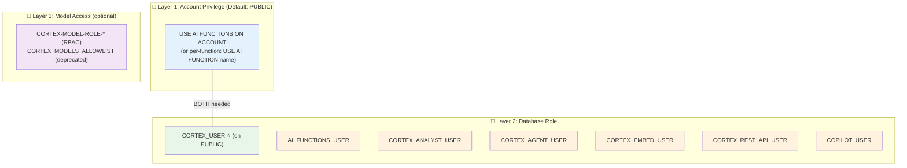

# 3.2 RBAC and Privileges

> **Exam Domain:** 3.0 — Snowflake Gen AI Governance (29%)  
> **Exam Objective:** Configure role-based access to Cortex AI features and functions

---

> 📘 **Key Terms**
>
> | Term | Definition |
> |------|-----------|
> | **RBAC** | Role-Based Access Control — privileges granted to roles, roles granted to users |
> | **Database Role** | A role scoped to a specific database (e.g., SNOWFLAKE.CORTEX_USER) |
> | **Owner's Rights** | Service runs with creator's privileges, not caller's |
> | **USE AI FUNCTIONS** | Account-level privilege enabling Cortex access |
>
> *See full [Glossary](../GLOSSARY.md)*

## Privilege Hierarchy



**Users need BOTH Layer 1 + Layer 2 to use AI functions.**

---

## Database Roles (Layer 2)

| Role | Access | Granted to PUBLIC? |
|------|--------|--------------------|
| `SNOWFLAKE.CORTEX_USER` | ALL Cortex features (functions + Analyst + Agents + Search + Code) | **Yes** |
| `SNOWFLAKE.AI_FUNCTIONS_USER` | Scalar AI functions only (excludes AI_AGG, AI_SUMMARIZE_AGG, services) | No |
| `SNOWFLAKE.CORTEX_ANALYST_USER` | Cortex Analyst API only | No |
| `SNOWFLAKE.CORTEX_AGENT_USER` | Cortex Agents API only | No |
| `SNOWFLAKE.CORTEX_EMBED_USER` | AI_EMBED + Cortex Search creation with managed embeddings | No |
| `SNOWFLAKE.CORTEX_REST_API_USER` | Cortex REST API only (no SQL functions, no services) | No |
| `SNOWFLAKE.COPILOT_USER` | Cortex Code in Snowsight | No |

---

## Per-Function Privileges (Layer 1 — Granular)

```sql
-- Revoke blanket access
REVOKE USE AI FUNCTIONS ON ACCOUNT FROM ROLE PUBLIC;

-- Grant specific function access
GRANT USE AI FUNCTION AI_COMPLETE ON ACCOUNT TO ROLE analyst_role;
GRANT USE AI FUNCTION AI_CLASSIFY ON ACCOUNT TO ROLE analyst_role;
GRANT USE AI FUNCTION AI_SENTIMENT ON ACCOUNT TO ROLE analyst_role;
```

**Per-function privilege names:**
`AI_COMPLETE`, `AI_CLASSIFY`, `AI_FILTER`, `AI_AGG`, `AI_EMBED`, `AI_EXTRACT`, `AI_SENTIMENT`, `AI_SUMMARIZE_AGG`, `AI_SIMILARITY`, `AI_TRANSCRIBE`, `AI_PARSE_DOCUMENT`, `AI_REDACT`, `AI_TRANSLATE`, `AI_COUNT_TOKENS`

**Relationship:** Per-function OR blanket `USE AI FUNCTIONS` — having either grants access.

---

## Restricting Access Pattern

```sql
USE ROLE ACCOUNTADMIN;

-- 1. Remove default broad access
REVOKE DATABASE ROLE SNOWFLAKE.CORTEX_USER FROM ROLE PUBLIC;
REVOKE USE AI FUNCTIONS ON ACCOUNT FROM ROLE PUBLIC;

-- 2. Create controlled role
CREATE ROLE ai_analyst;
GRANT DATABASE ROLE SNOWFLAKE.AI_FUNCTIONS_USER TO ROLE ai_analyst;
GRANT USE AI FUNCTION AI_COMPLETE ON ACCOUNT TO ROLE ai_analyst;
GRANT USE AI FUNCTION AI_CLASSIFY ON ACCOUNT TO ROLE ai_analyst;

-- 3. Model restriction (optional)
GRANT APPLICATION ROLE SNOWFLAKE."CORTEX-MODEL-ROLE-LLAMA3.1-70B" TO ROLE ai_analyst;

-- 4. Assign to users
GRANT ROLE ai_analyst TO USER analyst_user;
```

---

## Disabling Features Account-Wide

```sql
-- Disable Cortex Analyst
ALTER ACCOUNT SET ENABLE_CORTEX_ANALYST = FALSE;

-- Disable cross-region (limits available models)
ALTER ACCOUNT SET CORTEX_ENABLED_CROSS_REGION = 'DISABLED';

-- Block all models except RBAC-granted
ALTER ACCOUNT SET CORTEX_MODELS_ALLOWLIST = 'None';
```

---

## Service-Specific Privileges

| Object | Privilege | Purpose |
|--------|-----------|---------|
| Cortex Search Service | `CREATE CORTEX SEARCH SERVICE` | Create new services |
| Cortex Search Service | `USAGE` | Query the service |
| Cortex Search Service | `OPERATE` | Suspend/resume |
| Agent | `CREATE AGENT` | Create agents |
| Agent | `USAGE` | Run the agent |
| MCP Server | `USAGE` | Use MCP server |
| Semantic View | `SELECT` | Required for Analyst tools |

---

## REST API Default Role (Exam-Critical)

The Cortex REST API uses the user's **DEFAULT ROLE** for determining permissions — not the session role.

```sql
-- REST API requests authenticate with the user's default role
-- If default role lacks CORTEX_USER, REST calls fail even if user HAS the role

-- Fix: Set the correct default role
ALTER USER my_user SET DEFAULT_ROLE = 'role_with_cortex_access';
```

**Key:** Even if a user has CORTEX_USER through another role, REST API won't use it unless it's their DEFAULT role. This is different from SQL (which uses session role).

---

## Exam Tips

1. **Two things needed**: Account privilege (USE AI FUNCTIONS) + Database role (CORTEX_USER)
2. **CORTEX_USER granted to PUBLIC by default** — revoke for restriction
3. **AI_FUNCTIONS_USER** excludes aggregate functions AND Cortex services
4. **Per-function has OR relationship** with blanket — either grants access
5. **Only ACCOUNTADMIN** can manage these privileges
6. **Database roles cannot be granted directly to users** — must go through account roles
7. **CORTEX_EMBED_USER** = least privilege for embedding + search creation
8. **Native apps** bypass USE AI FUNCTIONS currently (known exception)
9. **CORTEX_REST_API_USER** = least privilege for REST API only access
10. **REST API uses DEFAULT ROLE** (not session role) — must be set correctly

---

## References

- [Privileges and Model Access](https://docs.snowflake.com/en/user-guide/snowflake-cortex/aisql-privileges-and-access)

---

<p align="center">
  <a href="./3.1a_Guardrails_and_Advanced_Governance.md">&#8592; Previous: 3.1a Guardrails & Advanced Governance</a> &nbsp;&nbsp;|&nbsp;&nbsp;
  <a href="./README.md">&#127968; Domain Home</a> &nbsp;&nbsp;|&nbsp;&nbsp;
  <a href="../README.md">&#128218; Main Home</a> &nbsp;&nbsp;|&nbsp;&nbsp;
  <a href="./3.3_Cost_Management_and_Monitoring.md">Next: 3.3 Cost Management & Monitoring &#8594;</a>
</p>
