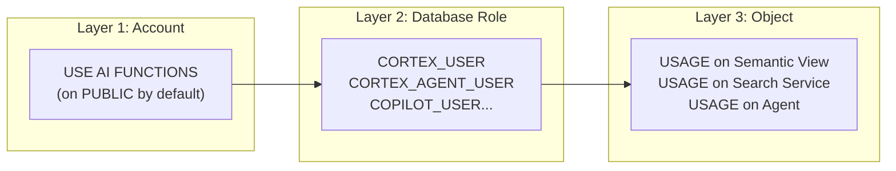

<h1 align="center">🔒 Domain 3: Snowflake Gen AI Governance</h1>

<p align="center">
  
  
  
</p>

---

> 🔐 **Focus:** How to control, monitor, and govern AI usage — RBAC, model access, cost tracking, and observability.

---

## 🎓 What You Need to Know

This domain tests the **enterprise governance mindset**. Think like a security admin or platform team lead:

1. **Who can access what?** — RBAC roles, database roles, privilege hierarchy
2. **How do you restrict models?** — Allowlist, Cortex Guard, input/output filtering
3. **How much does it cost?** — Usage views, credit tracking, per-token vs compute billing
4. **How do you monitor quality?** — TruLens, RAG Triad, Cortex Analyst evaluations

### 📋 Prerequisites

- Understanding of Snowflake RBAC (roles, grants, database roles)
- Familiarity with ACCOUNT_USAGE views
- Concepts from Domain 2 (what functions exist and how they're called)

### 🧠 Study Approach

| Step | What to Do | Key Concept |
|------|-----------|-------------|
| 1 | Read 3.1 + 3.1a | Model restrictions + Cortex Guard |
| 2 | Read 3.2 | The privilege hierarchy (3 layers: account privilege + database role + object grants) |
| 3 | Read 3.3 | Usage tracking views and credit formulas |
| 4 | Read 3.4 | TruLens, RAG Triad, LLM-as-judge evaluations |
| 5 | Scenarios + Quiz | Apply governance thinking to real situations |

### 💡 Governance Mental Model



> **Exam Key:** Users need ALL THREE layers to access a specific AI feature.

---

## 📚 Topics

| | # | Topic | File |
|---|---|-------|------|
| 🔑 | 3.1 | Model Access Controls | [3.1_Model_Access_Controls.md](./3.1_Model_Access_Controls.md) |
| 🛡️ | 3.1a | Guardrails & Advanced Governance | [3.1a_Guardrails_and_Advanced_Governance.md](./3.1a_Guardrails_and_Advanced_Governance.md) |
| 👥 | 3.2 | RBAC and Privileges | [3.2_RBAC_and_Privileges.md](./3.2_RBAC_and_Privileges.md) |
| 💰 | 3.3 | Cost Management & Monitoring | [3.3_Cost_Management_and_Monitoring.md](./3.3_Cost_Management_and_Monitoring.md) |
| 👁️ | 3.4 | AI Observability | [3.4_AI_Observability.md](./3.4_AI_Observability.md) |

---

## 🎯 Scenarios & Quiz

| | Resource | File |
|---|----------|------|
| 📋 | Scenarios & Governance Decisions | [Scenarios_Domain3.md](./Scenarios_Domain3.md) |
| ✅ | Quiz (50 Questions) | [quiz/Questions_Domain3.md](./quiz/Questions_Domain3.md) |

---

## 👥 RBAC Roles Quick Reference

```
┌─────────────────────────────────────────────────────────────────────┐
│  ROLE                          │ ACCESS                │ DEFAULT?   │
├────────────────────────────────┼───────────────────────┼────────────┤
│  SNOWFLAKE.CORTEX_USER         │ ALL Cortex features   │ ✅ PUBLIC  │
│  SNOWFLAKE.AI_FUNCTIONS_USER   │ Scalar AI functions   │ ❌         │
│  SNOWFLAKE.CORTEX_ANALYST_USER │ Analyst only          │ ❌         │
│  SNOWFLAKE.CORTEX_AGENT_USER   │ Agents only           │ ❌         │
│  SNOWFLAKE.CORTEX_EMBED_USER   │ Embeddings + Search   │ ❌         │
│  SNOWFLAKE.CORTEX_REST_API_USER│ REST API only         │ ❌         │
│  SNOWFLAKE.COPILOT_USER        │ Code in Snowsight     │ ❌         │
└────────────────────────────────┴───────────────────────┴────────────┘
```

---

## ⚠️ Key Exam Traps

> ❌ **Trap:** Users only need CORTEX_USER to use AI functions  
> ✅ **Truth:** Need BOTH `USE AI FUNCTIONS` privilege AND a database role

> ❌ **Trap:** RBAC and allowlist use AND logic  
> ✅ **Truth:** Access if **EITHER** permits it (OR relationship)

> ❌ **Trap:** REST API uses the session role  
> ✅ **Truth:** REST API uses the user's **DEFAULT ROLE**

> ❌ **Trap:** AI_COUNT_TOKENS has token charges  
> ✅ **Truth:** Only compute cost — no token billing

---

<p align="center">
  <a href="../2_Snowflake_Gen_AI_and_LLM_Functions/README.md">← Domain 2</a> &nbsp;&nbsp;|&nbsp;&nbsp;
  <a href="../README.md">🏠 Main Home</a> &nbsp;&nbsp;|&nbsp;&nbsp;
  <a href="../4_Snowflake_Document_AI/README.md">Domain 4 →</a>
</p>
