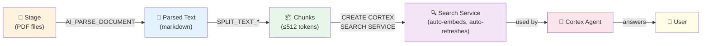

# 4.3 Automated Document Pipelines

> **Exam Domain:** 4.0 — Snowflake Document Processing (15%)  
> **Exam Objective:** Build automated pipelines for document ingestion and processing

---

## End-to-End Document Pipeline Architecture



---

## Pattern: Stream + Task Pipeline

```sql
-- 1. Create processing table
CREATE TABLE parsed_documents (
    file_path VARCHAR,
    content TEXT,
    category VARCHAR,
    parsed_at TIMESTAMP
);

-- 2. Create stream on directory table metadata
CREATE STREAM new_files_stream 
  ON STAGE doc_stage;

-- 3. Create processing task
CREATE TASK process_new_documents
  WAREHOUSE = doc_processing_wh
  SCHEDULE = '5 MINUTE'
  WHEN SYSTEM$STREAM_HAS_DATA('new_files_stream')
AS
INSERT INTO parsed_documents
SELECT
    RELATIVE_PATH,
    AI_PARSE_DOCUMENT(
        TO_FILE('@doc_stage', RELATIVE_PATH),
        {'mode': 'LAYOUT'}
    ):content,
    AI_CLASSIFY(
        AI_PARSE_DOCUMENT(TO_FILE('@doc_stage', RELATIVE_PATH), {'mode': 'OCR'}):content,
        ['Invoice', 'Contract', 'Report', 'Correspondence']
    ),
    CURRENT_TIMESTAMP()
FROM new_files_stream
WHERE METADATA$ACTION = 'INSERT';

-- 4. Resume task
ALTER TASK process_new_documents RESUME;
```

---

## Pattern: Dynamic Table Pipeline

```sql
-- Declarative: auto-processes new files
CREATE DYNAMIC TABLE chunked_documents
  TARGET_LAG = '1 hour'
  WAREHOUSE = doc_wh
AS
WITH parsed AS (
    SELECT
        RELATIVE_PATH AS source_file,
        AI_PARSE_DOCUMENT(
            TO_FILE('@doc_stage', RELATIVE_PATH),
            {'mode': 'LAYOUT'}
        ):content AS content
    FROM DIRECTORY(@doc_stage)
    WHERE RELATIVE_PATH LIKE '%.pdf'
)
SELECT
    source_file,
    f.INDEX AS chunk_index,
    f.VALUE::VARCHAR AS chunk_text,
    AI_EMBED('snowflake-arctic-embed-l-v2.0', f.VALUE::VARCHAR) AS embedding
FROM parsed,
LATERAL FLATTEN(
    SPLIT_TEXT_RECURSIVE_CHARACTER(
        content, 
        'snowflake-arctic-embed-l-v2.0', 
        {'max_tokens': 512, 'overlap': 50}
    )
) f;
```

---

## Pattern: Cortex Search over Documents

```sql
-- Auto-refreshing search over parsed documents
CREATE CORTEX SEARCH SERVICE document_search
  ON chunk_text
  ATTRIBUTES source_file, category
  WAREHOUSE = search_wh
  TARGET_LAG = '1 hour'
AS (
    SELECT chunk_text, source_file, category
    FROM chunked_documents
);
```

---

## Arctic-Extract Fine-Tuning (Complete Reference)

Fine-tune the extraction model for domain-specific documents.

### Training Data Format

Arctic-extract uses **Snowflake Dataset objects** (different from LLM fine-tuning which uses prompt/completion):

| Column | Type | Description |
|--------|------|-------------|
| `File` | STRING | Stage path to document (e.g., `@db.schema.stage/file.pdf`) |
| `Prompt` | JSON | Key-question pairs defining what to extract |
| `Response` | JSON | Expected key-value extraction results |

### Requirements
- **Minimum 20 documents** recommended for fine-tuning
- Max 100 unique questions for entity extraction
- Max 10 unique questions for table extraction
- Max 1,000 unique document files in Dataset
- Questions × total pages ≤ 50,000
- Supported formats: PDF, PNG, JPG/JPEG, TIFF/TIF

### Complete Workflow

```sql
-- 1. Create table with training data
CREATE TABLE extract_training (f FILE, p VARCHAR, r VARCHAR);

INSERT INTO extract_training (f, p, r)
SELECT 
    TO_FILE('@docs', '1.pdf'),
    '{"vendor": "Who is the vendor?", "total": "What is the total amount?"}',
    '{"vendor": "Acme Corp", "total": "3762.56"}';

-- 2. Create Dataset object
CREATE DATASET my_extract_dataset;

-- 3. Add version with properly formatted columns
ALTER DATASET my_extract_dataset ADD VERSION 'v1' FROM (
    SELECT 
        FL_GET_STAGE(f) || '/' || FL_GET_RELATIVE_PATH(f) AS "file",
        p AS "prompt",
        r AS "response"
    FROM extract_training
);

-- 4. Start fine-tuning job
SELECT SNOWFLAKE.CORTEX.FINETUNE(
    'CREATE',
    '@db.schema.my_extract_model',
    'arctic-extract',
    'snow://dataset/db.schema.my_extract_dataset/versions/v1'
);

-- 5. Check status
SELECT SNOWFLAKE.CORTEX.FINETUNE('DESCRIBE', '<job_id>');

-- 6. Use fine-tuned model (NAMED PARAMETER syntax)
SELECT AI_EXTRACT(
    model => 'db.schema.my_extract_model',
    file => TO_FILE('@docs', 'new_invoice.pdf')
);

-- 7. Override questions at inference time
SELECT AI_EXTRACT(
    model => 'db.schema.my_extract_model',
    file => TO_FILE('@docs', 'doc.pdf'),
    responseFormat => [['name', 'What is the employee name?'], ['city', 'Where do they live?']]
);
```

### Key Differences from LLM Fine-Tuning

| Aspect | LLM Fine-Tuning | arctic-extract Fine-Tuning |
|--------|----------------|---------------------------|
| **Training data** | `prompt` + `completion` columns | Dataset with `File` + `Prompt` + `Response` |
| **Base models** | llama3.x, mistral-7b, mixtral | arctic-extract only |
| **Data source** | SQL query | `snow://dataset/...` URI |
| **Inference** | AI_COMPLETE('model', ...) | AI_EXTRACT(model => 'model', file => ...) |
| **Privilege** | CREATE MODEL on schema | CREATE MODEL on schema + READ on stage |

---

## Exam Tips

1. **Stream on stage** detects new files automatically
2. **Dynamic tables** = declarative document processing pipeline
3. **Parse → Chunk → Embed → Search** is the standard pipeline
4. **Cortex Search** auto-refreshes as underlying data changes
5. **arctic-extract** can be fine-tuned for domain-specific extraction
6. **SPLIT_TEXT_RECURSIVE_CHARACTER** for chunking after parsing
7. **TARGET_LAG** controls pipeline freshness

---

<p align="center">
  <a href="./4.2_Document_Preparation_and_Management.md">&#8592; Previous: 4.2 Document Preparation & Management</a> &nbsp;&nbsp;|&nbsp;&nbsp;
  <a href="./README.md">&#127968; Domain Home</a> &nbsp;&nbsp;|&nbsp;&nbsp;
  <a href="../README.md">&#128218; Main Home</a> &nbsp;&nbsp;|&nbsp;&nbsp;
  <a href="./4.4_Troubleshooting_and_Optimization.md">Next: 4.4 Troubleshooting & Optimization &#8594;</a>
</p>
