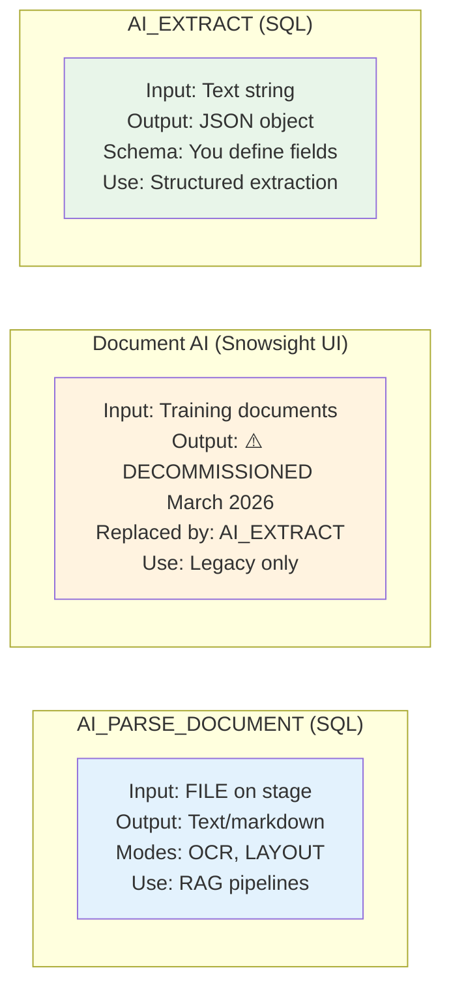

<h1 align="center">📄 Domain 4: Snowflake Document Processing</h1>

<p align="center">
  
  
  
</p>

---

> 📑 **Focus:** Parsing, extracting, and processing documents using Snowflake's AI functions and pipeline patterns.

---

## 🎓 What You Need to Know

This is the smallest domain (15%) but has highly specific, testable content. The exam focuses on:

1. **Function differences** — AI_PARSE_DOCUMENT (get text) vs AI_EXTRACT (get structured fields) vs Document AI (UI pipeline)
2. **Stage and file handling** — FILE data type, TO_FILE, encryption requirements, case sensitivity
3. **Pipeline patterns** — How to build automated document processing with streams + tasks or dynamic tables
4. **Fine-tuning** — arctic-extract with Dataset objects for custom extraction

### 📋 Prerequisites

- Understanding of Snowflake stages (internal/external)
- Knowledge of AI functions from Domain 2 (AI_COMPLETE, AI_EXTRACT, AI_CLASSIFY)
- Basic understanding of Streams and Tasks

### 🧠 Study Approach

| Step | What to Do | What You Learn |
|------|-----------|---------------|
| 1 | Read 4.1 | Core functions: AI_PARSE_DOCUMENT modes, Document AI privileges |
| 2 | Read 4.2 | File prep: stages, FILE type, encryption, DIRECTORY() |
| 3 | Read 4.3 | Full pipeline: chunking → embedding → search + arctic-extract fine-tuning |
| 4 | Read 4.4 | Common errors and performance optimization |
| 5 | Quiz (40 Qs) | Verify you know the distinctions that get tested |

### 💡 Key Distinction to Remember



---

## 📚 Topics

| | # | Topic | File |
|---|---|-------|------|
| 📑 | 4.1 | Document Parsing Functions | [4.1_Document_Parsing_Functions.md](./4.1_Document_Parsing_Functions.md) |
| 📁 | 4.2 | Document Preparation & Management | [4.2_Document_Preparation_and_Management.md](./4.2_Document_Preparation_and_Management.md) |
| ⚙️ | 4.3 | Automated Document Pipelines | [4.3_Automated_Document_Pipelines.md](./4.3_Automated_Document_Pipelines.md) |
| 🔧 | 4.4 | Troubleshooting & Optimization | [4.4_Troubleshooting_and_Optimization.md](./4.4_Troubleshooting_and_Optimization.md) |

---

## 🎯 Scenarios & Quiz

| | Resource | File |
|---|----------|------|
| 📋 | Scenarios & Pipeline Decisions | [Scenarios_Domain4.md](./Scenarios_Domain4.md) |
| ✅ | Quiz (40 Questions) | [quiz/Questions_Domain4.md](./quiz/Questions_Domain4.md) |

---

## 🔀 Document Processing Decision Tree

```
📄 What do you need from the document?
│
├── 📝 Full text content (for search/RAG)?
│   └── ✅ AI_PARSE_DOCUMENT (OCR or LAYOUT mode)
│
├── 🏷️ Specific structured fields (vendor, amount, date)?
│   └── ✅ AI_EXTRACT (with JSON schema)
│
├── ❓ Answer questions ABOUT the document?
│   └── ✅ AI_COMPLETE with TO_FILE (multimodal)
│
├── 🏷️ Classify document type?
│   └── ✅ AI_CLASSIFY with TO_FILE
│
└── 🖥️ ~~Visual pipeline with Snowsight UI training?~~
    └── ⚠️ DECOMMISSIONED (March 2026) — Use AI_EXTRACT instead
```

---

## ⚠️ Key Exam Traps

> ❌ **Trap:** SNOWFLAKE_FULL encryption works with AI functions  
> ✅ **Truth:** SNOWFLAKE_FULL is client-side — **NOT supported**. Use SNOWFLAKE_SSE

> ❌ **Trap:** Filenames on stages are case-insensitive  
> ✅ **Truth:** **CASE-SENSITIVE** — #1 cause of "file not found" errors

> ❌ **Trap:** LAYOUT mode is more expensive than OCR  
> ✅ **Truth:** Both modes bill at **970 tokens/page** — same cost

> ❌ **Trap:** Document AI and AI_PARSE_DOCUMENT are the same  
> ✅ **Truth:** Document AI is a Snowsight UI pipeline feature. AI_PARSE_DOCUMENT is a SQL function.

---

<p align="center">
  <a href="../3_Snowflake_Gen_AI_Governance/README.md">← Domain 3</a> &nbsp;&nbsp;|&nbsp;&nbsp;
  <a href="../README.md">🏠 Main Home</a>
</p>
