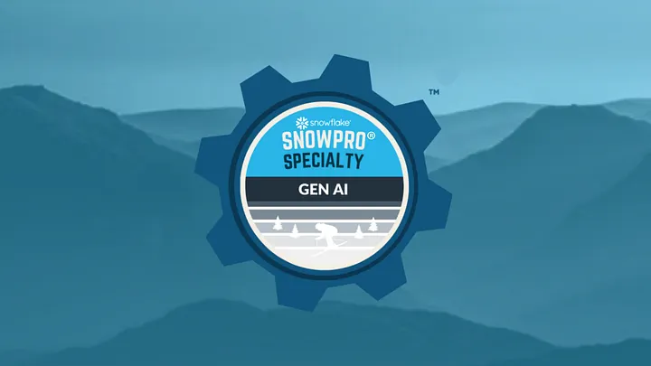
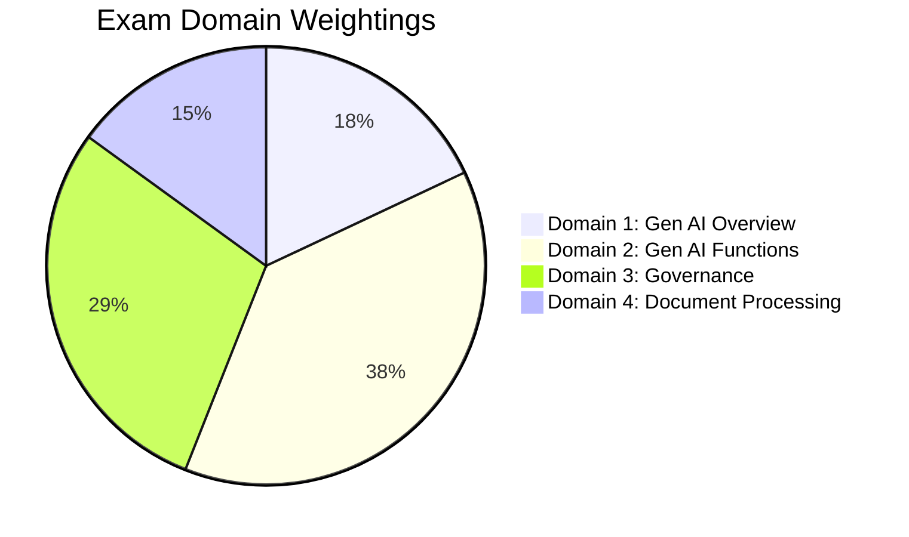
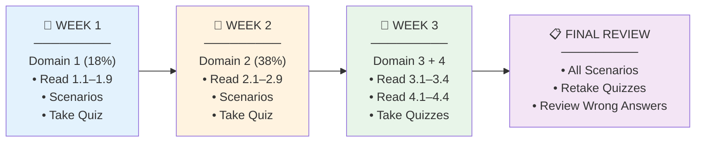

<p align="center">
  
</p>

<p align="center">
  
  
  
</p>

<h1 align="center">🎓 SnowPro Specialty: Generative AI (C02)</h1>
<h3 align="center">Complete Study Guide & Certification Bible</h3>

<p align="center">
  
  
  
  
</p>

<p align="center">
  <b>Author:</b> Harish Kumar Upadrasta<br/>
  <b>Repository:</b> <a href="https://github.com/harishupadrasta/Snowflake-SnowPro-Specialty--Generative-AI">github.com/harishupadrasta/Snowflake-SnowPro-Specialty--Generative-AI</a>
</p>

---

## 🧭 Why This Guide Exists

This isn't just a collection of notes — it's a **structured certification bible** designed so that anyone reading it cover-to-cover can pass the SnowPro Specialty: Generative AI exam. Every section is:

- **Exam-mapped** — each file ties directly to an official exam objective
- **Scenario-driven** — real-world "when would you use X vs Y?" decision-making
- **Gotcha-aware** — exam traps and common wrong answers are explicitly called out
- **Self-contained** — you shouldn't need to look elsewhere; official docs are referenced for depth

### 🎯 Who Is This For?

| Profile | How to Use This Guide |
|---------|----------------------|
| **Already working with Snowflake AI** | Skim notes, focus on quiz questions and scenarios to find gaps |
| **New to Gen AI on Snowflake** | Read sequentially from Domain 1 → 4, do quizzes at end of each |
| **Cramming before the exam** | Read each domain's exam traps, do all 200 quiz questions, review wrong answers |
| **Using as a reference** | Use the [Glossary](./GLOSSARY.md) + TOC to jump to specific topics |

### 💡 Exam Strategy Tips

1. **Domain 2 is 38% of the exam** — spend the most time here. Know every function's syntax and return type.
2. **Read the question carefully** — many questions test "which function" or "which role" with subtle word differences.
3. **Elimination works** — if you can eliminate 2 options, you have a 50% chance on the remaining 2.
4. **Time management** — 115 minutes for 60 questions = ~1.9 min/question. Flag hard ones and return later.
5. **Both namespaces are valid** — `SNOWFLAKE.CORTEX.COMPLETE()` and `AI_COMPLETE()` both appear in answers.

---

## 📋 Exam Details

<table>
<tr><td>📝 <b>Exam Code</b></td><td>GES-C01 / C02</td></tr>
<tr><td>❓ <b>Questions</b></td><td>60</td></tr>
<tr><td>⏱️ <b>Duration</b></td><td>115 minutes</td></tr>
<tr><td>✅ <b>Passing Score</b></td><td>750 / 1000</td></tr>
<tr><td>📅 <b>Study Guide Version</b></td><td>April 30, 2026</td></tr>
<tr><td>🔑 <b>Prerequisite</b></td><td>SnowPro Core (recommended)</td></tr>
</table>

---

## 📊 Domain Breakdown



| | Domain | Weight | Questions | Study Notes |
|---|--------|--------|-----------|-------------|
| 🏗️ | **Gen AI Overview** | 18% | ~11 | [Domain 1 →](./1_Snowflake_for_Gen_AI_Overview/README.md) |
| ⚡ | **Gen AI Functions** | 38% | ~23 | [Domain 2 →](./2_Snowflake_Gen_AI_and_LLM_Functions/README.md) |
| 🔒 | **Governance** | 29% | ~17 | [Domain 3 →](./3_Snowflake_Gen_AI_Governance/README.md) |
| 📄 | **Document Processing** | 15% | ~9 | [Domain 4 →](./4_Snowflake_Document_AI/README.md) |

---

## 🎯 What This Covers

> 💡 Every exam objective is mapped to a topic file containing SQL examples, architecture diagrams, decision matrices, and exam tips.

### How Each Topic File is Structured

Every topic file follows a consistent format to maximize learning:

| Section | Purpose |
|---------|---------|
| **Key Terms box** | Defines new vocabulary as a quick-reference table |
| **Concept explanation** | What it is, why it matters, how it works |
| **SQL examples** | Copy-paste-ready code you can run in Snowflake |
| **Architecture diagrams** | Mermaid diagrams showing how components connect |
| **Exam tips** | Specific traps, gotchas, and commonly tested points |
| **Navigation footer** | Previous / Home / Next for sequential reading |

### Namespace Reminder

Both function namespaces appear on the exam:

```sql
-- ✅ Both are valid and tested:
SELECT SNOWFLAKE.CORTEX.COMPLETE('llama3.1-70b', 'Hello');
SELECT AI_COMPLETE('llama3.1-70b', 'Hello');
```

---

## 📚 Full Table of Contents

### 🏗️ Domain 1 — Snowflake for Gen AI Overview (18%)

| | File | Topic |
|---|------|-------|
| 🌐 | [1.1_Snowflake_Cortex_Overview.md](./1_Snowflake_for_Gen_AI_Overview/1.1_Snowflake_Cortex_Overview.md) | Architecture, models, billing, security |
| 🔍 | [1.2_Cortex_Search.md](./1_Snowflake_for_Gen_AI_Overview/1.2_Cortex_Search.md) | Hybrid search, all parameters, limits |
| 🔍 | [1.2a_Cortex_Search_Advanced.md](./1_Snowflake_for_Gen_AI_Overview/1.2a_Cortex_Search_Advanced.md) | Scoring weights, analytical search |
| 📊 | [1.3_Cortex_Analyst.md](./1_Snowflake_for_Gen_AI_Overview/1.3_Cortex_Analyst.md) | Semantic Views, VQR, custom instructions |
| 🤖 | [1.4_Cortex_Agents.md](./1_Snowflake_for_Gen_AI_Overview/1.4_Cortex_Agents.md) | CREATE AGENT, tools, orchestration |
| 💬 | [1.5_Snowflake_Intelligence.md](./1_Snowflake_for_Gen_AI_Overview/1.5_Snowflake_Intelligence.md) | CoWork UI, no-code access |
| 💻 | [1.6_Cortex_Code.md](./1_Snowflake_for_Gen_AI_Overview/1.6_Cortex_Code.md) | Dev assistant, cross-region requirement |
| 🧩 | [1.6a_CoCo_CoWork_Skills_Plugins.md](./1_Snowflake_for_Gen_AI_Overview/1.6a_CoCo_CoWork_Skills_Plugins.md) | Agent SDK, Skills, Plugins catalog |
| 🌍 | [1.7_Cross_Region_Inference.md](./1_Snowflake_for_Gen_AI_Overview/1.7_Cross_Region_Inference.md) | CORTEX_ENABLED_CROSS_REGION |
| 🐳 | [1.8_Model_Registry_and_SPCS.md](./1_Snowflake_for_Gen_AI_Overview/1.8_Model_Registry_and_SPCS.md) | Custom models, containers |
| 🐳 | [1.8a_SPCS_Deep_Dive.md](./1_Snowflake_for_Gen_AI_Overview/1.8a_SPCS_Deep_Dive.md) | log_model, Docker, service types |
| 🔌 | [1.9_MCP_and_CKE.md](./1_Snowflake_for_Gen_AI_Overview/1.9_MCP_and_CKE.md) | MCP servers, Knowledge Extensions |
| 🎯 | [Scenarios_Domain1.md](./1_Snowflake_for_Gen_AI_Overview/Scenarios_Domain1.md) | 10 decision scenarios |
| ✅ | [quiz/Questions_Domain1.md](./1_Snowflake_for_Gen_AI_Overview/quiz/Questions_Domain1.md) | **50 practice questions** |

### ⚡ Domain 2 — Snowflake Gen AI Functions (38%)

| | File | Topic |
|---|------|-------|
| 🧠 | [2.1_AI_Complete_and_General_Functions.md](./2_Snowflake_Gen_AI_and_LLM_Functions/2.1_AI_Complete_and_General_Functions.md) | Syntax, structured output, Cortex Guard |
| 🏷️ | [2.2_Task_Specific_Functions.md](./2_Snowflake_Gen_AI_and_LLM_Functions/2.2_Task_Specific_Functions.md) | CLASSIFY, EXTRACT, FILTER, AGG, SENTIMENT... |
| 📐 | [2.3_Vector_Functions.md](./2_Snowflake_Gen_AI_and_LLM_Functions/2.3_Vector_Functions.md) | AI_EMBED, cosine similarity, L1/L2 |
| 🔧 | [2.4_Helper_Functions.md](./2_Snowflake_Gen_AI_and_LLM_Functions/2.4_Helper_Functions.md) | COUNT_TOKENS, SPLIT_TEXT, TO_FILE, PROMPT |
| 📈 | [2.5_Data_Analysis_Patterns.md](./2_Snowflake_Gen_AI_and_LLM_Functions/2.5_Data_Analysis_Patterns.md) | Classification, extraction at scale |
| 💬 | [2.6_Chat_Interfaces_and_Streamlit.md](./2_Snowflake_Gen_AI_and_LLM_Functions/2.6_Chat_Interfaces_and_Streamlit.md) | Streamlit in Snowflake, RAG chatbot |
| 🔄 | [2.7_Cortex_in_Data_Pipelines.md](./2_Snowflake_Gen_AI_and_LLM_Functions/2.7_Cortex_in_Data_Pipelines.md) | Dynamic tables, streams + tasks |
| 🐳 | [2.8_Third_Party_Models_SPCS.md](./2_Snowflake_Gen_AI_and_LLM_Functions/2.8_Third_Party_Models_SPCS.md) | SPCS deployment, Model Registry |
| 🌐 | [2.8a_REST_API_and_Fine_Tuning.md](./2_Snowflake_Gen_AI_and_LLM_Functions/2.8a_REST_API_and_Fine_Tuning.md) | REST API, streaming, tool calling, fine-tuning |
| ⚙️ | [2.9_Performance_Considerations.md](./2_Snowflake_Gen_AI_and_LLM_Functions/2.9_Performance_Considerations.md) | Model selection, cost optimization |
| 🎯 | [Scenarios_Domain2.md](./2_Snowflake_Gen_AI_and_LLM_Functions/Scenarios_Domain2.md) | 12 function-selection scenarios |
| ✅ | [quiz/Questions_Domain2.md](./2_Snowflake_Gen_AI_and_LLM_Functions/quiz/Questions_Domain2.md) | **60 practice questions** |

### 🔒 Domain 3 — Governance (29%)

| | File | Topic |
|---|------|-------|
| 🔑 | [3.1_Model_Access_Controls.md](./3_Snowflake_Gen_AI_Governance/3.1_Model_Access_Controls.md) | RBAC for models, allowlist |
| 🛡️ | [3.1a_Guardrails_and_Advanced_Governance.md](./3_Snowflake_Gen_AI_Governance/3.1a_Guardrails_and_Advanced_Governance.md) | Cortex Guard, model lifecycle |
| 👥 | [3.2_RBAC_and_Privileges.md](./3_Snowflake_Gen_AI_Governance/3.2_RBAC_and_Privileges.md) | Database roles, per-function privileges |
| 💰 | [3.3_Cost_Management_and_Monitoring.md](./3_Snowflake_Gen_AI_Governance/3.3_Cost_Management_and_Monitoring.md) | Usage views, credit tracking |
| 👁️ | [3.4_AI_Observability.md](./3_Snowflake_Gen_AI_Governance/3.4_AI_Observability.md) | TruLens, RAG Triad, evaluations |
| 🎯 | [Scenarios_Domain3.md](./3_Snowflake_Gen_AI_Governance/Scenarios_Domain3.md) | 8 governance scenarios |
| ✅ | [quiz/Questions_Domain3.md](./3_Snowflake_Gen_AI_Governance/quiz/Questions_Domain3.md) | **50 practice questions** |

### 📄 Domain 4 — Document Processing (15%)

| | File | Topic |
|---|------|-------|
| 📑 | [4.1_Document_Parsing_Functions.md](./4_Snowflake_Document_AI/4.1_Document_Parsing_Functions.md) | AI_PARSE_DOCUMENT, OCR/LAYOUT, Document AI |
| 📁 | [4.2_Document_Preparation_and_Management.md](./4_Snowflake_Document_AI/4.2_Document_Preparation_and_Management.md) | Stages, FILE type, encryption |
| ⚙️ | [4.3_Automated_Document_Pipelines.md](./4_Snowflake_Document_AI/4.3_Automated_Document_Pipelines.md) | RAG pipeline, arctic-extract fine-tuning |
| 🔧 | [4.4_Troubleshooting_and_Optimization.md](./4_Snowflake_Document_AI/4.4_Troubleshooting_and_Optimization.md) | Common errors, performance |
| 🎯 | [Scenarios_Domain4.md](./4_Snowflake_Document_AI/Scenarios_Domain4.md) | 8 document processing scenarios |
| ✅ | [quiz/Questions_Domain4.md](./4_Snowflake_Document_AI/quiz/Questions_Domain4.md) | **40 practice questions** |

---

## 🗺️ Study Roadmap



---

## 📈 Content Statistics

<table>
<tr>
<td align="center"><h3>📝</h3><b>34</b><br/>Topic Files</td>
<td align="center"><h3>❓</h3><b>200</b><br/>Quiz Questions</td>
<td align="center"><h3>🎯</h3><b>4</b><br/>Scenario Guides</td>
<td align="center"><h3>📚</h3><b>38</b><br/>Scenarios Total</td>
</tr>
</table>

---

## 📖 Quick Reference

| | Resource | Description |
|---|----------|-------------|
| 📖 | [**GLOSSARY.md**](./GLOSSARY.md) | All keywords & terms defined in one place |
| 📋 | [**CONTRIBUTING.md**](./CONTRIBUTING.md) | How to contribute to this guide |

---

## 🔗 Official Resources

| Resource | Link |
|----------|------|
| 🌐 Snowflake AI Features Overview | https://docs.snowflake.com/en/guides-overview-ai-features |
| 📄 Exam Registration | https://www.snowflake.com/certifications/ |
| 📖 Cortex AI Documentation | https://docs.snowflake.com/en/user-guide/snowflake-cortex |
| 🧪 Free Trial Account | https://signup.snowflake.com/ |

### 📝 Community Study Resources

| Part | Topic | Link |
|------|-------|------|
| 1 | Exam Info & Getting Started | [Medium — Part 1](https://medium.com/snowflake/%EF%B8%8F-snowpro-specialty-gen-ai-certification-tutorial-part-1-exam-info-and-starting-with-snowflake-3d01c381d8e9) |
| 2 | Snowflake Cortex (Functions, Agents) | [Medium — Part 2](https://medium.com/snowflake/%EF%B8%8F-snowpro-specialty-gen-ai-certification-tutorial-part-2-snowflake-cortex-4c9792d5379b) |
| 3 | CoWork (formerly Copilot) | [Medium — Part 3](https://medium.com/snowflake/%EF%B8%8F-snowpro-specialty-gen-ai-certification-tutorial-part-3-snowflake-copilot-607413ef22d3) |
| 4 | Security & Governance | [Medium — Part 4](https://medium.com/snowflake/%EF%B8%8F-snowpro-specialty-gen-ai-certification-tutorial-part-4-security-e4ce0bf70a2c) |
| 5 | Document AI | [Medium — Part 5](https://medium.com/snowflake/%EF%B8%8F-snowpro-specialty-gen-ai-certification-tutorial-part-5-document-ai-12d7e9de9127) |

---

## 🤝 Contributing

Found a gap? Have a better explanation? See [CONTRIBUTING.md](./CONTRIBUTING.md) for guidelines.

---

<p align="center">
  <b>Harish Kumar Upadrasta — 2026</b><br/>
  <a href="https://github.com/harishupadrasta/SnowPro-GENAI">⭐ Star this repo if it helps you pass!</a>
</p>
